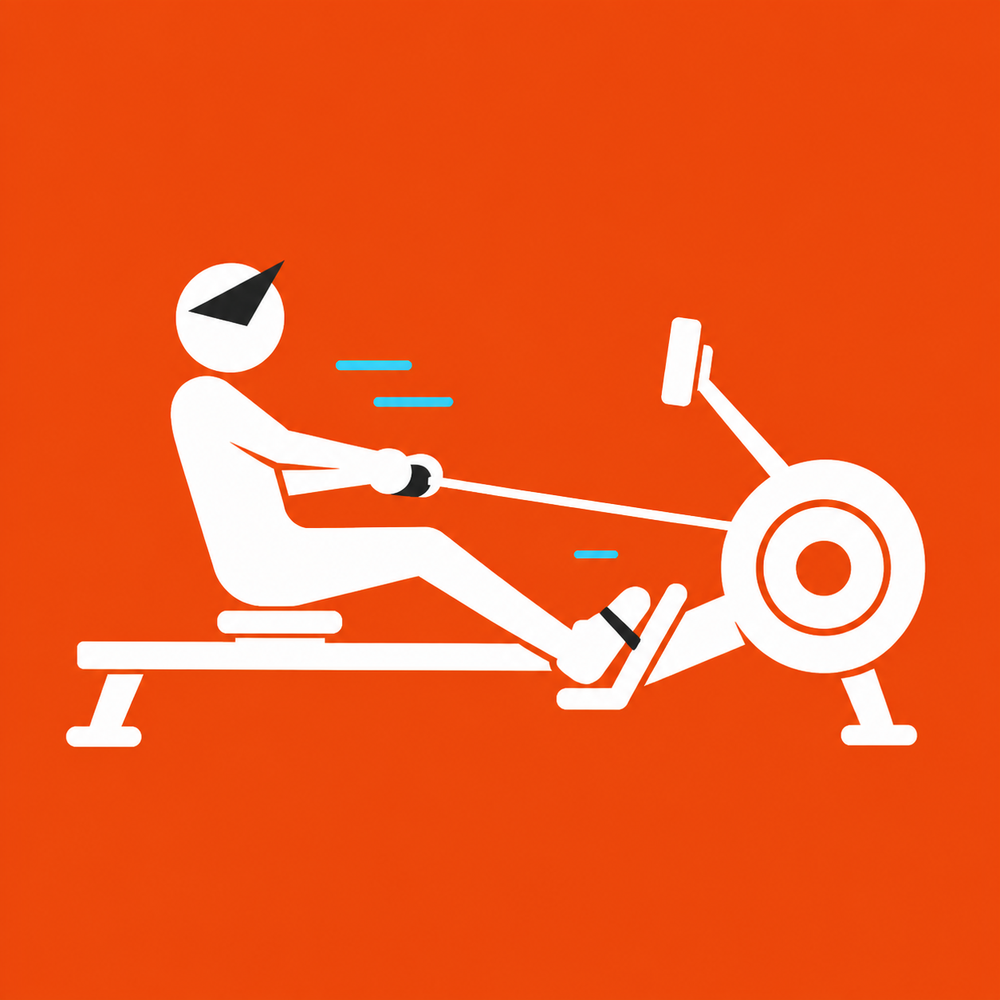

<div align="center">


</div>

# AIUI Sports Agents

AIUI Sports Agents integrates three smart-glasses sports applications in one public repository:

<table>
  <tr>
    <td align="center" width="33%"><a href="projects/smartrun.md"></a><br><strong>AISmartRun</strong><br>Running · HRS / RSC / IMU<br><a href="apps/smartrun/">Source</a></td>
    <td align="center" width="33%"><a href="projects/aibike.md"></a><br><strong>AIBike</strong><br>Cycling · HRS / CSC / CPS / FTMS / IMU<br><a href="apps/aibike/">Source</a></td>
    <td align="center" width="33%"><a href="projects/aismartrower.md"></a><br><strong>AISmartRower</strong><br>Indoor rowing · FTMS Rower Data / HRS<br><a href="apps/aismartrower/">Source</a></td>
  </tr>
</table>

<p><a href="projects/aismartpaddle.md"></a> <strong>AISmartPaddle</strong> is <code>INCUBATING · SOURCE PENDING</code>: only its project card and L2 result context are published.</p>

The applications share one GitHub entry point, benchmark, evidence language, and governance model. They remain separate AIX runtimes with independent sport logic, tests, builds, and hardware gates; this is not one monolithic multi-sport app. AISmartPaddle is also registered as an incubating benchmark project, but its application source is not included.


## EverMind memory bridge for AISmartRun

<p align="center">
  <a href="https://evermind.ai"></a>
</p>

AISmartRun keeps sensor collection, its HUD, and deterministic summaries independent. When an HTTPS coach backend is configured, it can request long-term context through `memory-context` and archive post-run summaries through `aiui-record`. Routing that backend to EverMind remains a deployment choice; this repository ships no production endpoint or key.

- **AISmartRun:** client contracts, a bounded queue, and failure fallback.
- **AIBike / AISmartRower:** no EverMind runtime dependency.
- **Raven:** related reading only; it does not participate in this repository or its AIX builds.

[Implementation boundary](apps/smartrun/README.md#evermind-oriented-backend-contract) · [EverMind](https://evermind.ai) · [GitHub](https://github.com/EverMind-AI) · [Raven](https://github.com/EverMind-AI/Raven) · [Discussions](https://github.com/EverMind-AI/Raven/discussions)

## License boundary

The repository root benchmark, governance tools, project cards, and documentation are open source under Apache-2.0. The application source under `apps/smartrun`, `apps/aibike`, and `apps/aismartrower` is source-available under each directory's unmodified PolyForm Noncommercial 1.0.0 license. Commercial use of an application requires a separate written commercial agreement before use. The root Apache license does not override those clearly marked nested licenses.

Previously released Apache-2.0 material remains under its existing grant. Third-party materials remain subject to their own terms. See [LICENSE_POLICY.md](LICENSE_POLICY.md) and [COMMERCIAL_LICENSE.md](COMMERCIAL_LICENSE.md).

## Evidence boundary

The shared rules are simple:

1. Prefer measured sensor data.
2. Label every estimate.
3. Keep unavailable data unavailable.
4. Bind every claim to a version, environment, and evidence level.

All four public result cards currently report L2 evidence. Source, tests, Reader, Preview, or a local AIX build do not prove Craft integration, radio behavior, Rokid hardware acceptance, AIUI Studio review, or store publication. Rower telemetry remains read-only and keeps Fitness Machine Control Point `0x2AD9` disabled. Paddle remains a project-card-only incubating track with pending source distribution.


## Start here

Run the root registry and benchmark checks with Node.js 20–25:

```bash
git clone https://github.com/EasonZhu1997/AIUI-Sports-Agents.git
cd AIUI-Sports-Agents
npm run validate
npm run report
```

Each application has its own lockfile and README. For example:

```bash
cd apps/smartrun
npm ci
npm test
npm run doctor:aiui
```

Generated `.aix` files stay local. These commands do not upload, install, submit, or publish anything.

See [README.md](README.md) for the complete Chinese guide, [benchmark/README.md](benchmark/README.md) for the evaluation model, [apps/README.md](apps/README.md) for the application boundary, and `projects/` for the public result cards.
