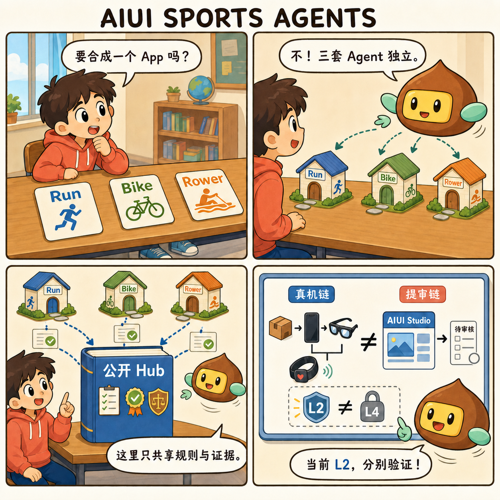

# AIUI Sports Agents

AIUI Sports Agents integrates three smart-glasses sports applications in one public repository:

| Application | Sport and protocols | Source |
| --- | --- | --- |
| AISmartRun | Running · HRS / RSC / IMU | [`apps/smartrun`](apps/smartrun/) |
| AIBike | Cycling · HRS / CSC / CPS / FTMS / IMU | [`apps/aibike`](apps/aibike/) |
| AISmartRower | Indoor rowing · FTMS Rower Data / HRS | [`apps/aismartrower`](apps/aismartrower/) |

The applications share one GitHub entry point, benchmark, evidence language, and governance model. They remain separate AIX runtimes with independent sport logic, tests, builds, and hardware gates; this is not one monolithic multi-sport app.



## License boundary

The repository root benchmark, governance tools, project cards, and documentation are open source under Apache-2.0. The application source under `apps/smartrun`, `apps/aibike`, and `apps/aismartrower` is source-available under each directory's unmodified PolyForm Noncommercial 1.0.0 license. Commercial use of an application requires a separate written commercial agreement before use. The root Apache license does not override those clearly marked nested licenses.

Previously released Apache-2.0 material remains under its existing grant. Third-party materials remain subject to their own terms. See [LICENSE_POLICY.md](LICENSE_POLICY.md) and [COMMERCIAL_LICENSE.md](COMMERCIAL_LICENSE.md).

## Evidence boundary

The shared rules are simple:

1. Prefer measured sensor data.
2. Label every estimate.
3. Keep unavailable data unavailable.
4. Bind every claim to a version, environment, and evidence level.

All three public result cards currently report L2 evidence. Source, tests, Reader, Preview, or a local AIX build do not prove Craft integration, radio behavior, Rokid hardware acceptance, AIUI Studio review, or store publication. Rower telemetry remains read-only and keeps Fitness Machine Control Point `0x2AD9` disabled.


## Start here

Run the root registry and benchmark checks with Node.js 20–25:

```bash
git clone https://github.com/EasonZhu1997/AIUI-Sports-Agents.git
cd AIUI-Sports-Agents
npm run validate
npm run report
```

Each application has its own lockfile and README. For example:

```bash
cd apps/smartrun
npm ci
npm test
npm run doctor:aiui
```

Generated `.aix` files stay local. These commands do not upload, install, submit, or publish anything.

See [README.md](README.md) for the complete Chinese guide, [benchmark/README.md](benchmark/README.md) for the evaluation model, [apps/README.md](apps/README.md) for the application boundary, and `projects/` for the public result cards.
