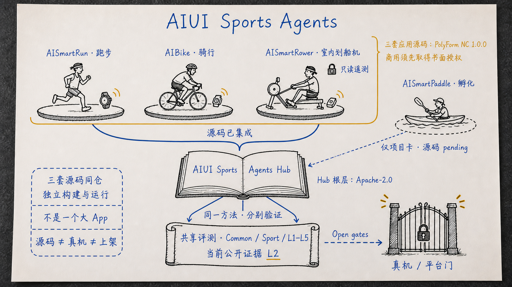
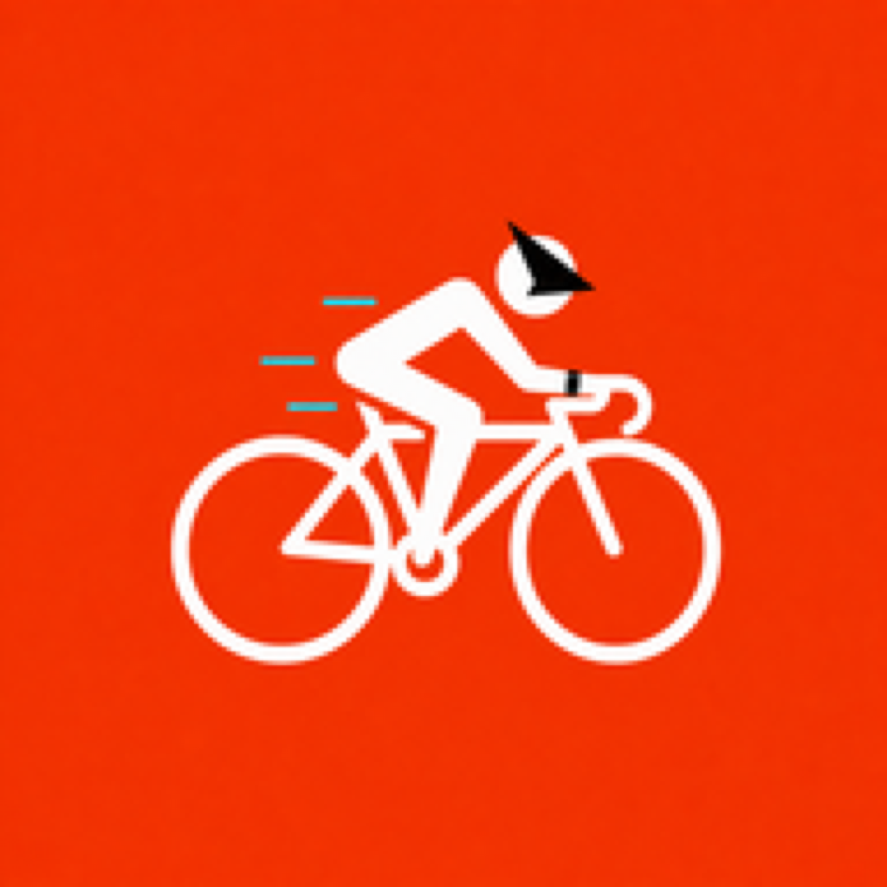
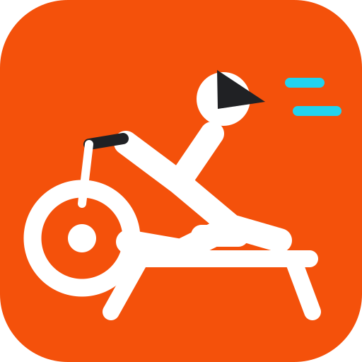
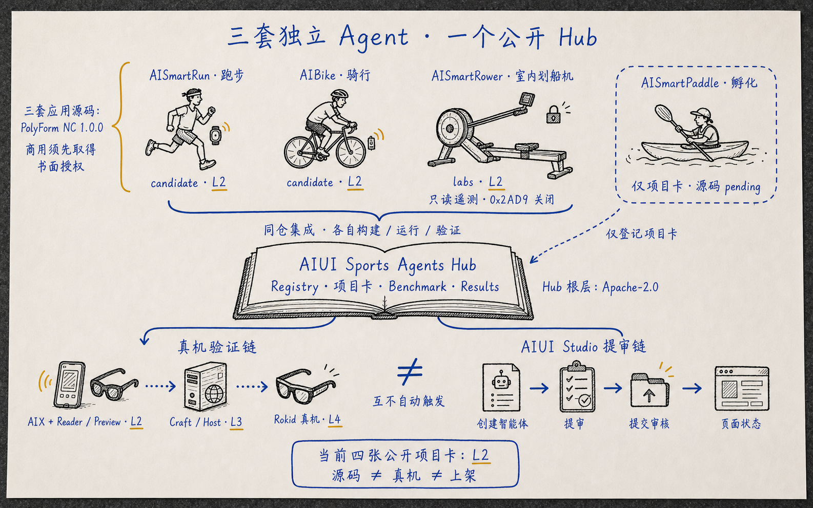
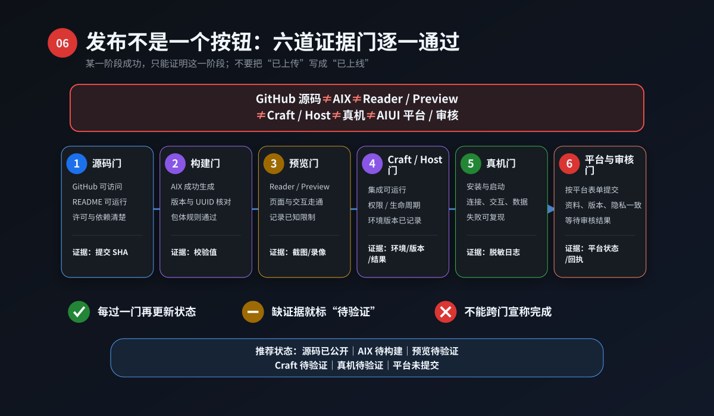
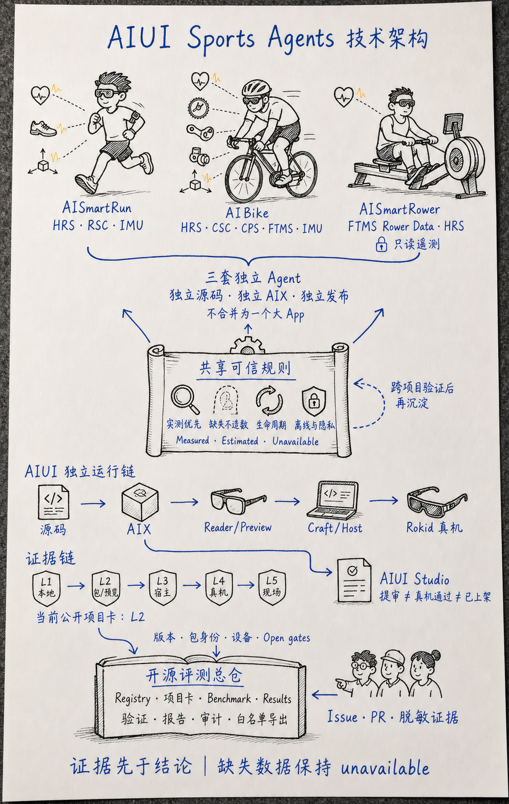
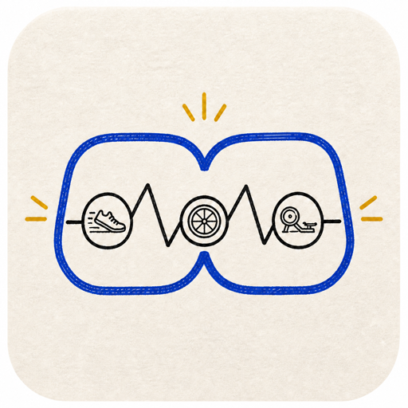

<div align="center" id="readme-top">



<p><strong>一个公开主仓，集成跑步、骑行与划船机三套智能眼镜运动 Agent</strong></p>

<p>
  <a href="https://github.com/EasonZhu1997/AIUI-Sports-Agents/actions/workflows/validate.yml"></a>
  <a href="LICENSE"></a>
  <a href="LICENSE_POLICY.md"></a>
  
  <a href="benchmark/evidence-levels.md"></a>
  <a href="README.en.md"></a>
</p>

[三套-Agent](#三套-agent一个主仓) · [项目矩阵](#项目矩阵) · [技术架构](#技术架构) · [快速开始](#快速开始) · [如何参与](#如何参与) · [评测体系](#评测体系) · [许可边界](LICENSE_POLICY.md)

</div>

# AIUI Sports Agents

AIUI Sports Agents 在同一个公开仓库中提供智能眼镜上的跑步、骑行与划船机 Agent 源码，同时登记 AISmartPaddle 孵化项目，并用一套可复核的方法分别记录“源码、包、预览、宿主、真机、平台”六个阶段。

> [!IMPORTANT]
> 仓库根层的评测规范、项目卡、机器可读结果、治理文档和维护工具采用 Apache-2.0；`apps/smartrun`、`apps/aibike`、`apps/aismartrower` 三个目录内的应用源码分别采用 PolyForm Noncommercial 1.0.0，商业使用须在开始前另行取得书面商业授权。AISmartPaddle 当前只有项目卡与 L2 上下文，应用源码仍为 `pending`。根许可证不覆盖三个明确标识的应用目录；源码公开也不代表 AIX 已上传、Rokid 真机通过、AIUI Studio 已提审或商店已上架。

## 为什么做这个项目

AIUI Sports Agents 把 Run、Bike、Rower 三套源码集成在一个主仓，但不把不同运动硬塞进一个运行时；Paddle 以 Incubating 项目卡保留在同一评测体系中。各垂直产品独立构建、独立运行、独立验证，共享一个 GitHub 入口和一套可以公开复核的证据语言。

| **Measured First** | **Honest Degradation** | **Evidence Bound** |
| --- | --- | --- |
| 真实传感器数据优先，来源必须可说明。 | 估算必须标注；拿不到的数据保持 `unavailable`。 | 每项能力都绑定版本、环境、包身份与证据等级。 |

共同方法可以复用，共同指标可以横向比较；不同运动的专项分不合并成一个没有意义的总排名。

## 三套 Agent，一个主仓

<table>
  <tr>
    <td align="center" width="33%">
      <a href="projects/smartrun.md"></a><br>
      <strong>AISmartRun</strong><br>跑步
    </td>
    <td align="center" width="33%">
      <a href="projects/aibike.md"></a><br>
      <strong>AIBike</strong><br>骑行
    </td>
    <td align="center" width="33%">
      <a href="projects/aismartrower.md"></a><br>
      <strong>AISmartRower</strong><br>室内划船机
    </td>
  </tr>
  <tr>
    <td><code>HRS · RSC · IMU</code><br><a href="apps/smartrun/">应用源码</a> · <a href="projects/smartrun.md">项目卡</a> · <a href="results/smartrun.json">L2 结果</a><br>标准 BLE HRS；RSC 同包真机待验。</td>
    <td><code>HRS · CSC · CPS · FTMS · IMU</code><br><a href="apps/aibike/">应用源码</a> · <a href="projects/aibike.md">项目卡</a> · <a href="results/aibike.json">L2 结果</a><br>多协议来源仲裁；真机门仍开放。</td>
    <td><code>FTMS Rower Data · HRS</code><br><a href="apps/aismartrower/">应用源码</a> · <a href="projects/aismartrower.md">项目卡</a> · <a href="results/aismartrower.json">L2 结果</a><br>只读遥测；禁止 <code>0x2AD9</code> 控制。</td>
  </tr>
</table>

<table>
  <tr>
    <td align="center" width="112"><a href="projects/aismartpaddle.md"></a></td>
    <td><strong>AISmartPaddle · 孵化项目</strong><br><code>INCUBATING · SOURCE PENDING</code><br>当前只公开<a href="projects/aismartpaddle.md">项目卡</a>与 <a href="results/aismartpaddle.json">L2 结果</a>，不提供应用源码或 AIX。图标只标识项目，不表示源码已发布。</td>
  </tr>
</table>

三套应用可以分别进入各自目录测试和构建；仓库根目录负责统一导航、评测、许可边界与贡献入口。

<p align="center">
  
</p>

<p align="center"><em>三套独立 Agent，共用一个公开入口；蓝墨关系图用于解释项目结构、许可与证据边界，不作为设备或真机证据。</em></p>

## 项目矩阵

公开状态快照更新于 **2026-09-02**。

| 项目 | 运动与协议 | Track | 版本 | 公开证据 | 结果摘要 | Open gates |
| --- | --- | --- | ---: | --- | --- | ---: |
| [AISmartRun](projects/smartrun.md) | 跑步 · HRS / RSC / IMU | `candidate` | `0.1.114` | `L2` | [Common 2P / 4~ · Sport 0P / 4~](results/smartrun.json) | 2 |
| [AIBike](projects/aibike.md) | 骑行 · HRS / CSC / CPS / FTMS / IMU | `candidate` | `0.3.80` | `L2` | [Common 2P / 4~ · Sport 1P / 3~](results/aibike.json) | 2 |
| [AISmartRower](projects/aismartrower.md) | 划船机 · FTMS Rower Data / HRS | `labs` | `0.0.1` | `L2` | [Common 2P / 4~ · Sport 0P / 2~ / 2B](results/aismartrower.json) | 3 |
| [AISmartPaddle](projects/aismartpaddle.md) | 皮划艇 + 划船机 · GPS / HRS / IMU / FTMS | `incubating` | `0.3.1` | `L2` | [Common 2P / 4~ · Sport 1P / 3~ / 2B](results/aismartpaddle.json) | 5 |

`P` = pass，`~` = partial，`B` = blocked。所有结果只在表中证据等级内成立。Run、Bike、Rower 三套应用源码已集成在 `apps/`，Paddle 源码仍为 `pending`；四张项目卡的公开证据都停留在 `L2`，源码可构建不等于 Craft、无线电、真机或平台门已经通过。

> AISmartRower 当前仅允许读取标准 FTMS Rower Data 与可选 HRS；Fitness Machine Control Point `0x2AD9` 保持关闭，不控制器械。

## 快速开始

本仓库当前没有运行时依赖。使用 Node.js **20–25**：

```bash
git clone https://github.com/EasonZhu1997/AIUI-Sports-Agents.git
cd AIUI-Sports-Agents
npm run validate
npm run report
```

`validate` 检查项目登记、42 个评测项的数据结构和公开文件边界；它不是“42 个端到端测试全部通过”。`report` 根据当前结果文件生成有证据等级约束的项目摘要。

进入应用目录可分别安装依赖并运行该应用自己的回归；例如：

```bash
cd apps/smartrun
npm ci
npm test
npm run doctor:aiui
```

Bike 与 Rower 的准确命令写在各自 README。构建产生的 `.aix` 保持在本地，不会由仓库命令自动上传、安装、提审或上架。

预期报告：

```text
AISmartRun    candidate  0.1.114  L2
AIBike        candidate  0.3.80   L2
AISmartRower  labs       0.0.1    L2
AISmartPaddle incubating 0.3.1    L2
```

<p align="right"><a href="#readme-top">返回顶部 ↑</a></p>

## 如何参与

不需要先会写代码。先选择最适合自己的入口：

| 角色 | 可以做什么 | 从这里开始 |
| --- | --- | --- |
| 浏览者 / 评测者 | 阅读项目卡、复现 Common 与 Sport 评测、核对结果边界 | [Benchmark](benchmark/README.md) · [项目矩阵](#项目矩阵) |
| 体验者 / 真机测试者 | 提交体验反馈、兼容性问题或脱敏的 Reader / Craft / 真机证据 | [体验与贡献问卷](https://github.com/EasonZhu1997/AIUI-Sports-Agents/issues/new?template=contribution-survey.yml) · [Bug 与真机证据](https://github.com/EasonZhu1997/AIUI-Sports-Agents/issues/new?template=bug-and-device-evidence.yml) |
| Hub 代码 / 文档贡献者 | 先用 Issue 对齐范围，再 Fork、建分支、测试并提交 Apache-2.0 Pull Request | [贡献指南](CONTRIBUTING.md) · [手把手图文教程](articles/从本地到GitHub_一步步开源AIUI项目.md) |
| 应用源码贡献者 | 先提交 Issue；在应用 CLA/权利流程正式启用前，不直接接收 `apps/` 下的外部代码 PR | [应用源码目录](apps/) · [CLA 草案边界](CLA.md) |
| 项目维护者 | 审计相邻私有源码、预演白名单导出、维护结果卡与发布边界 | [开源边界](docs/OPEN_SOURCE_BOUNDARIES.md) · [发布清单](docs/PUBLICATION_CHECKLIST.md) |

GitHub 问卷只用于开源协作，不会自动生成 AIX、上传眼镜、创建 AIUI Studio 智能体或提交平台审核。

## 证据优先工作流

<p align="center">
  
</p>

一次成功只能证明它真正覆盖的那一门：

- GitHub 源码可读，不等于 AIX 可生成；
- AIX 与 Reader / Preview 可检查，不等于 Craft 或 Rokid 真机通过；
- 真机上传成功，不等于完整运动闭环稳定；
- AIUI Studio 提审，不等于审核通过或已上架。

每次结果都应保留失败、跳过、不可用与 Open gates，而不是只展示最好的一次。

## 技术架构

<p align="center">
  
</p>

图中三条运行链彼此独立：Run 处理 HRS/RSC 与 IMU 回退，Bike 处理 HRS/CSC/CPS/FTMS 与来源仲裁，Rower 只读取 FTMS Rower Data 与可选 HRS。共享层提供评测语言、证据门、隐私与许可规则，不代替各应用的运行时。

## 评测体系

每个项目结果由三部分组成：

| 层 | 解决的问题 | 是否可跨运动比较 |
| --- | --- | --- |
| [Common](benchmark/common.md) | 场景闭环、数据诚实、实时与生命周期、人因安全、离线与隐私、可复现性 | 可以 |
| Sport | 跑步、骑行、皮划艇或划船机的协议、准确性和降级规则 | 仅同一运动、同类协议与相近硬件 |
| [Evidence Level](benchmark/evidence-levels.md) | 当前结论到底由本地测试、预览、宿主、真机还是现场对照支持 | 用于限定结论，不是成熟度营销词 |

专项入口：[Running](benchmark/running.md) · [Cycling](benchmark/cycling.md) · [Indoor Rowing](benchmark/indoor-rowing.md) · [Outdoor Kayak](benchmark/paddling.md)

| 等级 | 证据范围 | 不能向上推断为 |
| --- | --- | --- |
| `L1` | 自动化本地测试、解析器、业务逻辑与 mock adapter | AIUI 宿主或真实设备 |
| `L2` | 本地 AIX、Reader / Preview、包体与语言检查 | Craft、无线电、按键或真机生命周期 |
| `L3` | Craft 或目标 Host 的交互与集成证据 | 真实外设持续流与完整现场闭环 |
| `L4` | 指定 Rokid 设备、固件、Host 和真实外设组合 | 其他设备、固件或长时间场景 |
| `L5` | 完整现场会话与参考设备对照 | 未覆盖环境和人群的泛化结论 |

当前四张公开项目卡均为 `L2`。

<p align="right"><a href="#readme-top">返回顶部 ↑</a></p>

## 仓库地图

```text
AIUI-Sports-Agents/
├── apps/        Run、Bike、Rower 三套独立应用源码（各自 PolyForm NC）
├── projects/    项目卡：范围、版本、协议与开放门
├── results/     机器可读的项目结果
├── benchmark/   Common、专项指标与证据等级
├── contracts/   可复核的协议与安全边界
├── docs/        开源、隐私、硬件证据与发布规则
├── licenses/    应用源码使用的标准许可证参考文本
├── scripts/     验证、报告、本地审计与白名单导出
├── articles/    参与开源和 AIUI 提交流程文章
└── assets/      本项目原创品牌资产
```

Run、Bike、Rower 三套运动应用已经集成在这个主仓中，但不会合并成一个单体；Paddle 目前仅保留孵化项目上下文。运动算法、页面状态机、权限和硬件验收分别维护；只有经过多个项目验证的稳定基础设施，才考虑进入共享层。

## 维护者工具

下面的白名单导出工具用于维护未来新增的相邻私有项目；当前三套已集成应用的普通访问者不需要执行。

仅在配置不存在时创建本地映射：

```bash
test -e registry/local-projects.json || \
  cp registry/local-projects.example.json registry/local-projects.json
```

审计本地项目：

```bash
npm run audit:local
npm run audit:local:strict
```

普通审计只报告；`strict` 在存在 blocker 时返回非零。warning 是必须人工确认仍被白名单排除的本地材料，不会被当成应用源码候选。

非商业源码可见快照的白名单导出先预演，不写文件：

```bash
npm run export:dry -- --project aibike
```

预演会同时输出应用源码 HEAD、Hub HEAD 与候选内容 manifest。只有应用仓的 [`SOURCE_DISTRIBUTION_APPROVAL.json`](docs/SOURCE_DISTRIBUTION_APPROVAL.md) 与 Hub 权威审批副本逐字段一致，Hub Registry、审批记录和导出器均已提交且与 Hub HEAD 相符，并与该 manifest、Registry 法定授权主体、PolyForm、商业授权及权利审查完全匹配，且所有 blocker 已关闭时，才在本地生成 `dist/` 快照：

```bash
npm run export:local -- --project aibike
```

这些工具不会创建 GitHub 仓库，也不会上传、签名、安装或发布 AIX。

## 当前与下一步

| 当前已经公开 | 下一步方向 |
| --- | --- |
| 一个公开主仓内的 Run、Bike、Rower 三套非商业源码快照，以及 Paddle 孵化项目卡 | 继续收紧可复现构建、依赖来源与贡献者权利门；Paddle 源码另行白名单审计 |
| 42 个登记评测项及自动结构验证 | 补齐绑定设备、固件、Host 与包身份的 L4 真机矩阵 |
| Common / Sport / L1–L5 评测方法 | 建立可重复的 L5 现场对照、误差与失败报告 |
| Hub Apache-2.0 与三个应用目录的 PolyForm 非商业许可边界 | 启用经法律审阅的商业合同与应用贡献者 CLA 流程；Paddle 发布前另建权利链 |

[完整路线图](ROADMAP.md) 描述方向，不是发布日期、平台审核或发布承诺。

## 文档中心

| 主题 | 文档 |
| --- | --- |
| 项目与评测 | [Benchmark 入口](benchmark/README.md) · [项目生命周期](docs/PROJECT_LIFECYCLE.md) · [Evidence Levels](docs/EVIDENCE_LEVELS.md) |
| 硬件与安全 | [硬件证据指南](docs/HARDWARE_EVIDENCE_GUIDE.md) · [Rower 安全边界](docs/ROWER_SAFETY_BOUNDARY.md) · [FTMS Rower Profile](contracts/ftms-rower-profile.md) |
| 许可与发布 | [许可作用域](LICENSE_POLICY.md) · [商业授权](COMMERCIAL_LICENSE.md) · [源码审批记录](docs/SOURCE_DISTRIBUTION_APPROVAL.md) · [CLA 草案](CLA.md) · [公开源码边界](docs/OPEN_SOURCE_BOUNDARIES.md) · [发布检查清单](docs/PUBLICATION_CHECKLIST.md) · [第三方说明](THIRD_PARTY_NOTICES.md) · [商标规则](TRADEMARKS.md) |
| GitHub 与 AIUI | [Public 项目参与图文教程](articles/从本地到GitHub_一步步开源AIUI项目.md) · [AIUI Studio 提交预填表](docs/AIUI_SUBMISSION_WORKSHEET.md) |
| 项目介绍 | [AIUI Sports Agents 开源项目怎么玩](articles/AIUI_Sports_Agents_开源项目怎么玩.md) · [English README](README.en.md) |

<p align="right"><a href="#readme-top">返回顶部 ↑</a></p>

## 贡献、安全与许可证

- 开始贡献前，请阅读 [CONTRIBUTING.md](CONTRIBUTING.md) 与 [CODE_OF_CONDUCT.md](CODE_OF_CONDUCT.md)。
- 安全漏洞、账号、个人数据或危险设备控制问题，请使用 [Private vulnerability reporting](https://github.com/EasonZhu1997/AIUI-Sports-Agents/security/advisories/new)，不要创建公开 Issue。
- 公开材料不得包含 key、token、真实 MAC、序列号、轨迹、未脱敏日志或无权再分发的 SDK、固件和素材；详见 [PRIVACY.md](PRIVACY.md)。
- 当前 Hub 中明确属于根层的代码、文档与原创品牌资产采用 [Apache License 2.0](LICENSE)，允许在满足其条件时商用；不能用“商用需授权”追溯限制这些 Apache 版本。
- `apps/smartrun`、`apps/aibike`、`apps/aismartrower` 各自明确标识的应用源码采用目录内未经修改的 [PolyForm Noncommercial 1.0.0](licenses/PolyForm-Noncommercial-1.0.0.md)；商业使用须按对应目录与根层的[商业授权流程](COMMERCIAL_LICENSE.md)取得单独书面许可。
- AISmartPaddle 当前只公开 Apache-2.0 的 Hub 项目卡、结果和评测上下文；其应用源码尚未发布，未来许可不能从当前项目卡推定。
- 许可范围、历史授权与贡献者权利链的说明见 [LICENSE_POLICY.md](LICENSE_POLICY.md)；真正权利以取得具体版本时附带的许可证和已签书面合同为准。第三方内容保持原许可证，项目名称和 Logo 的使用还受 [TRADEMARKS.md](TRADEMARKS.md) 约束。

<div align="center">



**Evidence before claims. Honest data before impressive demos.**

</div>
