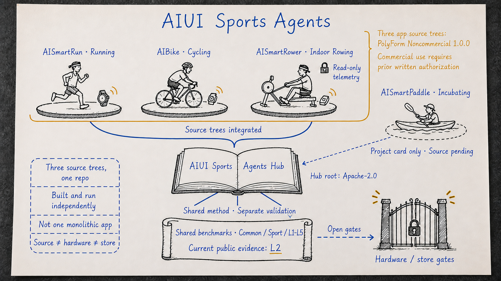
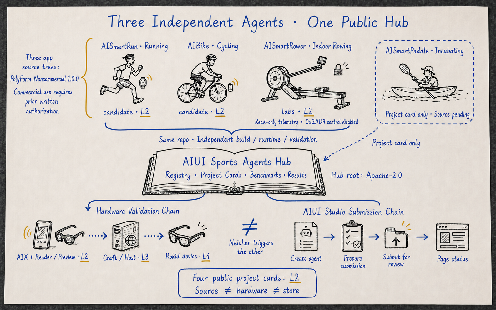
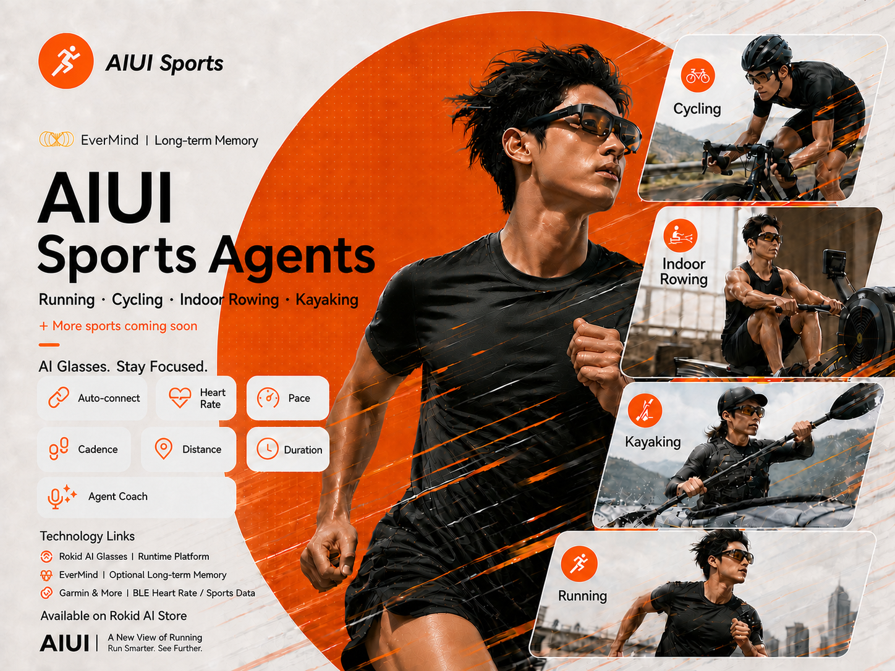
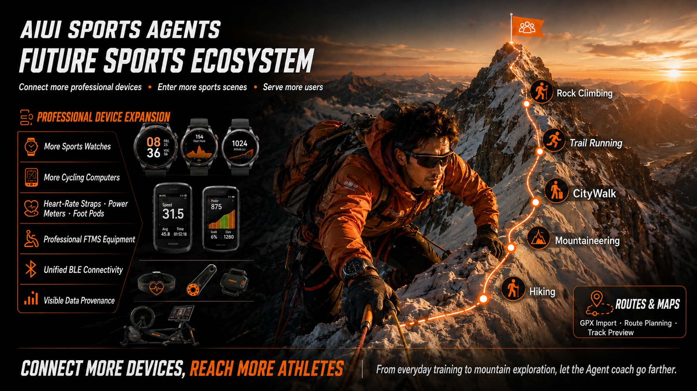
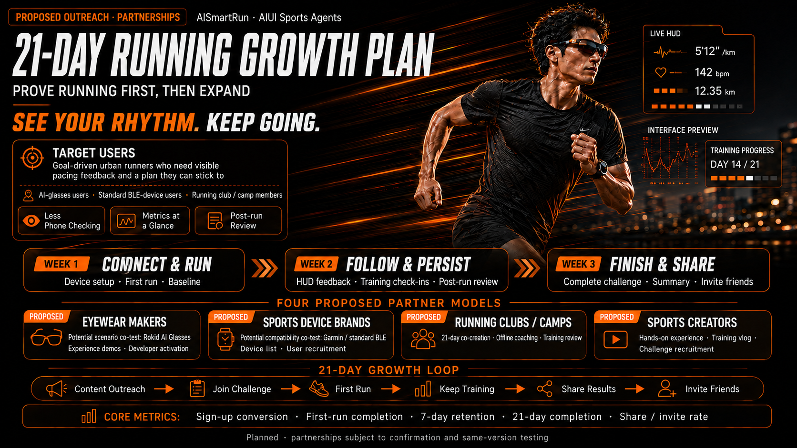
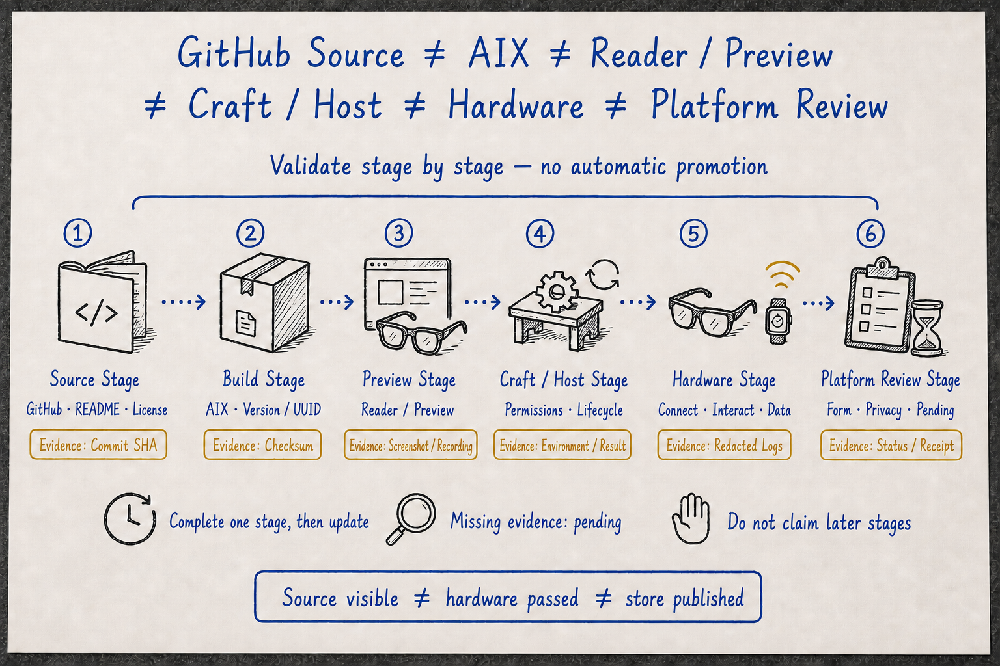
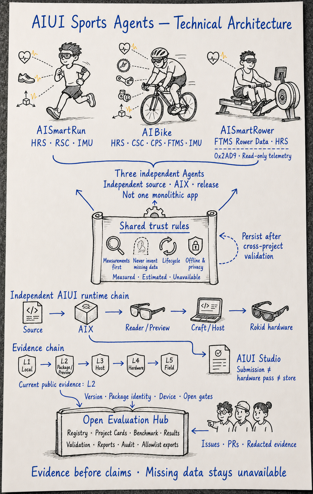
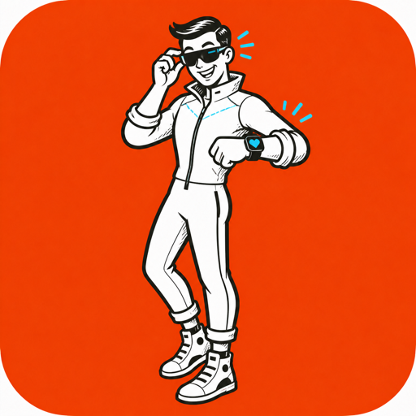

<div align="center" id="readme-top">

<p><strong>English</strong> · <a href="README.zh-CN.md">简体中文</a></p>



<p><strong>One public Hub integrating three smart-glasses sports Agents for running, cycling, and indoor rowing</strong></p>

<p>
  <a href="https://github.com/EasonZhu1997/AIUI-Sports-Agents/actions/workflows/validate.yml"></a>
  <a href="LICENSE"></a>
  <a href="LICENSE_POLICY.md"></a>
  
  <a href="benchmark/evidence-levels.md"></a>
  <a href="README.zh-CN.md"></a>
</p>

[Three Agents](#three-agents-one-hub) · [AISmartRun memory bridge](#evermind-long-term-memory-bridge-for-aismartrun) · [Future ecosystem](#future-sports-ecosystem) · [Outreach plan](#21-day-running-outreach-plan) · [Project matrix](#project-matrix) · [Architecture](#technical-architecture) · [Quick start](#quick-start) · [Contributing](#how-to-participate) · [Benchmarks](#benchmark-system) · [Licensing](LICENSE_POLICY.md)

</div>

# AIUI Sports Agents

AIUI Sports Agents publishes the source for running, cycling, and indoor-rowing Agents for smart glasses in one public repository. It also registers AISmartPaddle as an incubating project and uses one auditable method to track six separate stages: source, package, preview, host, hardware, and platform.

> [!IMPORTANT]
> The root-level benchmark specifications, project cards, machine-readable results, governance documents, and maintenance tools are licensed under Apache-2.0. Application source inside `apps/smartrun`, `apps/aibike`, and `apps/aismartrower` is separately licensed under PolyForm Noncommercial 1.0.0; commercial use requires separate written commercial authorization before it begins. AISmartPaddle currently provides only a project card and L2 context, while application source remains `pending`. The root license does not cover the three explicitly marked application directories. Public source also does not mean that an AIX has been uploaded, passed on Rokid hardware, submitted to AIUI Studio, or published in a store.

## Why this project exists

AIUI Sports Agents integrates the Run, Bike, and Rower source trees in one Hub without forcing different sports into a single runtime. Paddle remains an Incubating project card within the same benchmark system. Each vertical product is built, run, and validated independently, while sharing one GitHub entry point and an evidence language that anyone can audit.

| **Measured First** | **Honest Degradation** | **Evidence Bound** |
| --- | --- | --- |
| Prefer real sensor data and identify its source. | Label estimates; keep unavailable data `unavailable`. | Bind every capability to a version, environment, package identity, and evidence level. |

Shared methods can be reused and common metrics can be compared across projects. Sport-specific scores are not combined into a meaningless overall ranking.

## Three Agents, one Hub

<table>
  <tr>
    <td align="center" width="33%">
      <a href="projects/smartrun.md"></a><br>
      <strong>AISmartRun</strong><br>Running
    </td>
    <td align="center" width="33%">
      <a href="projects/aibike.md"></a><br>
      <strong>AIBike</strong><br>Cycling
    </td>
    <td align="center" width="33%">
      <a href="projects/aismartrower.md"></a><br>
      <strong>AISmartRower</strong><br>Indoor rowing
    </td>
  </tr>
  <tr>
    <td><code>HRS · RSC · IMU</code><br><a href="apps/smartrun/">Application source</a> · <a href="projects/smartrun.md">Project card</a> · <a href="results/smartrun.json">L2 result</a><br>Standard BLE HRS; optional EverMind-oriented memory-backend contract; same-package RSC hardware validation remains open.</td>
    <td><code>HRS · CSC · CPS · FTMS · IMU</code><br><a href="apps/aibike/">Application source</a> · <a href="projects/aibike.md">Project card</a> · <a href="results/aibike.json">L2 result</a><br>Multi-protocol source arbitration; hardware validation is not yet complete.</td>
    <td><code>FTMS Rower Data · HRS</code><br><a href="apps/aismartrower/">Application source</a> · <a href="projects/aismartrower.md">Project card</a> · <a href="results/aismartrower.json">L2 result</a><br>Read-only telemetry; <code>0x2AD9</code> control is prohibited.</td>
  </tr>
</table>

<table>
  <tr>
    <td align="center" width="112"><a href="projects/aismartpaddle.md"></a></td>
    <td><strong>AISmartPaddle · Incubating project</strong><br><code>INCUBATING · SOURCE PENDING</code><br>Only the <a href="projects/aismartpaddle.md">project card</a> and <a href="results/aismartpaddle.json">L2 result</a> are currently public; no application source or AIX is provided. The icon identifies the project and does not imply that its source has been released.</td>
  </tr>
</table>

Each of the three applications can be tested and built from its own directory. The repository root provides shared navigation, benchmarks, licensing boundaries, and contribution entry points.

<p align="center">
  
</p>

<p align="center"><em>Three independent Agents, one public entry point. This blue-ink relationship map explains the project structure, licensing, and evidence boundaries; it is not device or hardware evidence.</em></p>

## EverMind long-term memory bridge for AISmartRun

<p align="center">
  <a href="https://evermind.ai"></a>
</p>

AISmartRun keeps sports collection, its HUD, and deterministic summaries independent. When an HTTPS coach backend is configured, it can retrieve long-term context through `memory-context` and archive post-run summaries through `aiui-record`. Whether that backend connects to EverMind is a deployment choice; this repository includes no production endpoint or key.

- **AISmartRun:** client contracts, a bounded queue, and failure fallback.

[Implementation boundary](apps/smartrun/README.md#evermind-oriented-backend-contract) · [EverMind website](https://evermind.ai) · [GitHub](https://github.com/EverMind-AI) · [Raven](https://github.com/EverMind-AI/Raven) · [Technical discussion](https://github.com/EverMind-AI/Raven/discussions)

## Multi-sport and Agent coaching overview

<p align="center">
  
</p>

Running, cycling, indoor rowing, and kayaking are the sports directions currently represented by public projects. Agent coaching connects live metrics, deterministic summaries, and optional long-term memory in one experience, with more sports on the way.

## Future Sports Ecosystem

<p align="center">
  
</p>

The next stage will continue to explore professional-device integrations, outdoor sports scenarios, and GPX route capabilities. Actual support is subject to the relevant version and test results.

## 21-Day Running Outreach Plan

<p align="center">
  
</p>

The first outreach cycle focuses on one running scenario: help target users connect, complete a first run, train consistently, and share results over 21 days. The partnerships shown are proposed collaboration models.

## Project matrix

Public status snapshot updated **2026-09-02**.

| Project | Sport and protocols | Track | Version | Public evidence | Result summary | Open gates |
| --- | --- | --- | ---: | --- | --- | ---: |
| [AISmartRun](projects/smartrun.md) | Running · HRS / RSC / IMU | `candidate` | `0.1.114` | `L2` | [Common 2P / 4~ · Sport 0P / 4~](results/smartrun.json) | 2 |
| [AIBike](projects/aibike.md) | Cycling · HRS / CSC / CPS / FTMS / IMU | `candidate` | `0.3.80` | `L2` | [Common 2P / 4~ · Sport 1P / 3~](results/aibike.json) | 2 |
| [AISmartRower](projects/aismartrower.md) | Indoor rowing · FTMS Rower Data / HRS | `labs` | `0.0.1` | `L2` | [Common 2P / 4~ · Sport 0P / 2~ / 2B](results/aismartrower.json) | 3 |
| [AISmartPaddle](projects/aismartpaddle.md) | Kayaking + indoor rowing · GPS / HRS / IMU / FTMS | `incubating` | `0.3.1` | `L2` | [Common 2P / 4~ · Sport 1P / 3~ / 2B](results/aismartpaddle.json) | 5 |

`P` = pass, `~` = partial, and `B` = blocked. Every result is valid only within the evidence level shown in the table. Run, Bike, and Rower application source is integrated under `apps/`; Paddle source remains `pending`. All four public project cards remain at L2. Buildable source does not prove that Craft, radio, or hardware validation is complete, nor does it prove platform approval.

> AISmartRower currently permits read-only access to standard FTMS Rower Data and optional HRS. Fitness Machine Control Point `0x2AD9` remains disabled, so the application does not control the machine.

## Quick start

The repository root currently has no runtime dependencies. Use Node.js **20–25**:

```bash
git clone https://github.com/EasonZhu1997/AIUI-Sports-Agents.git
cd AIUI-Sports-Agents
npm run validate
npm run report
```

`validate` checks the project registry, the data structure of 42 benchmark items, and public-file boundaries. It does not mean that all 42 end-to-end tests passed. `report` generates evidence-level-constrained project summaries from the current result files.

Enter an application directory to install its dependencies and run its own regressions. For example:

```bash
cd apps/smartrun
npm ci
npm test
npm run doctor:aiui
```

The exact Bike and Rower commands are documented in their respective READMEs. Generated `.aix` files remain local; repository commands do not automatically upload, install, submit, or publish them.

Expected report:

```text
AISmartRun    candidate  0.1.114  L2
AIBike        candidate  0.3.80   L2
AISmartRower  labs       0.0.1    L2
AISmartPaddle incubating 0.3.1    L2
```

<p align="right"><a href="#readme-top">Back to top ↑</a></p>

## How to participate

You do not need to know how to code before getting involved. Start with the role that fits you best:

| Role | What you can do | Start here |
| --- | --- | --- |
| Reader / evaluator | Read project cards, reproduce Common and Sport benchmarks, and verify result boundaries | [Benchmark](benchmark/README.md) · [Project matrix](#project-matrix) |
| Experience tester / hardware tester | Submit experience feedback, compatibility issues, or sanitized Reader / Craft / hardware evidence | [Experience and contribution survey](https://github.com/EasonZhu1997/AIUI-Sports-Agents/issues/new?template=contribution-survey.yml) · [Bug and hardware evidence](https://github.com/EasonZhu1997/AIUI-Sports-Agents/issues/new?template=bug-and-device-evidence.yml) |
| Hub code / documentation contributor | Align scope in an Issue, then fork, create a branch, test, and submit an Apache-2.0 Pull Request | [Contribution guide](CONTRIBUTING.md) · [Step-by-step illustrated guide](articles/从本地到GitHub_一步步开源AIUI项目.md) |
| Application-source contributor | Open an Issue first; external code PRs under `apps/` are not accepted until the application CLA and rights process is formally enabled | [Application source directories](apps/) · [Draft CLA boundary](CLA.md) |
| Project maintainer | Audit adjacent private source, rehearse allowlisted exports, and maintain result cards and publication boundaries | [Open-source boundaries](docs/OPEN_SOURCE_BOUNDARIES.md) · [Publication checklist](docs/PUBLICATION_CHECKLIST.md) |

The GitHub survey is only for open-source collaboration. It does not automatically generate an AIX, upload to glasses, create an AIUI Studio Agent, or submit anything for platform review.

## Evidence-first workflow

<p align="center">
  
</p>

A success proves only the stage it actually covers:

- Readable GitHub source does not prove that an AIX can be generated.
- An AIX that can be inspected in Reader / Preview does not prove Craft or Rokid hardware acceptance.
- A successful hardware upload does not prove a stable, complete sports loop.
- Submission to AIUI Studio does not mean approval or store publication.

Every result should retain failures, skipped checks, unavailable data, and open gates instead of showing only the best run.

## Technical architecture

<p align="center">
  
</p>

The three runtime paths in the diagram remain independent: Run handles HRS/RSC with IMU fallback, Bike handles HRS/CSC/CPS/FTMS with source arbitration, and Rower only reads FTMS Rower Data and optional HRS. The shared layer defines benchmark language, evidence stages, privacy, and licensing rules; it does not replace an application's runtime.

## Benchmark system

Each project result has three components:

| Layer | Question it answers | Comparable across sports? |
| --- | --- | --- |
| [Common](benchmark/common.md) | Scenario loop, data honesty, real-time behavior and lifecycle, human-factors safety, offline behavior and privacy, reproducibility | Yes |
| Sport | Protocols, accuracy, and degradation rules for running, cycling, kayaking, or indoor rowing | Only within the same sport, similar protocol, and comparable hardware |
| [Evidence Level](benchmark/evidence-levels.md) | Whether a conclusion is backed by local tests, preview, host, hardware, or field comparison | Constrains a claim; it is not a marketing maturity label |

Sport-specific entry points: [Running](benchmark/running.md) · [Cycling](benchmark/cycling.md) · [Indoor Rowing](benchmark/indoor-rowing.md) · [Outdoor Kayak](benchmark/paddling.md)

| Level | Evidence scope | Must not be extrapolated to |
| --- | --- | --- |
| `L1` | Automated local tests, parsers, business logic, and mock adapters | AIUI host or real devices |
| `L2` | Local AIX, Reader / Preview, package integrity, and language checks | Craft, radio, buttons, or on-device lifecycle |
| `L3` | Craft or target-Host interaction and integration evidence | Continuous streams from real peripherals or a complete field loop |
| `L4` | A specified combination of Rokid device, firmware, Host, and real peripherals | Other devices, firmware, or long-duration scenarios |
| `L5` | Complete field sessions compared against reference devices | Generalized claims about untested environments or populations |

All four public project cards currently report `L2`.

<p align="right"><a href="#readme-top">Back to top ↑</a></p>

## Repository map

```text
AIUI-Sports-Agents/
├── apps/        Three independent Run, Bike, and Rower apps (each PolyForm NC)
├── projects/    Project cards: scope, version, protocols, and open gates
├── results/     Machine-readable project results
├── benchmark/   Common metrics, sport-specific metrics, and evidence levels
├── contracts/   Auditable protocol and safety boundaries
├── docs/        Open-source, privacy, hardware-evidence, and release rules
├── licenses/    Standard license reference text used by application source
├── scripts/     Validation, reports, local audits, and allowlisted exports
├── articles/    Guides to open-source participation and AIUI submission
└── assets/      Original brand assets for this project
```

The Run, Bike, and Rower applications are integrated in this Hub but are not merged into one monolith. Paddle currently retains only its incubating-project context. Sports algorithms, page state machines, permissions, and hardware acceptance are maintained separately. Only stable infrastructure validated across multiple projects is considered for the shared layer.

## Maintainer tools

The allowlisted export tools below support future additions from adjacent private projects. Ordinary users of the three already integrated applications do not need to run them.

Create a local mapping only if it does not already exist:

```bash
test -e registry/local-projects.json || \
  cp registry/local-projects.example.json registry/local-projects.json
```

Audit local projects:

```bash
npm run audit:local
npm run audit:local:strict
```

The normal audit reports findings only; `strict` returns a non-zero exit code when blockers exist. Warnings identify local materials that must be manually confirmed as excluded by the allowlist; they are not treated as application-source candidates.

Preview an allowlisted, noncommercial source-visible export without writing files:

```bash
npm run export:dry -- --project aibike
```

The preview also prints the application-source HEAD, Hub HEAD, and candidate-content manifest. A local `dist/` snapshot may be generated only when the application repository's [`SOURCE_DISTRIBUTION_APPROVAL.json`](docs/SOURCE_DISTRIBUTION_APPROVAL.md) matches the Hub's authoritative approval copy field by field; the Hub registry, approval record, and exporter are committed and match Hub HEAD; they fully match the manifest, the registry's legally authorized entity, PolyForm, commercial-licensing requirements, and rights review; and every blocker is closed:

```bash
npm run export:local -- --project aibike
```

These tools do not create a GitHub repository and do not upload, sign, install, or publish an AIX.

## Current status and next steps

| Public now | Next direction |
| --- | --- |
| Noncommercial source snapshots for Run, Bike, and Rower in one public Hub, plus the Paddle incubating project card | Continue tightening reproducible builds, dependency provenance, and contributor-rights gates; audit Paddle source through a separate allowlist process |
| 42 registered benchmark items with automated structural validation | Complete an L4 hardware matrix bound to device, firmware, Host, and package identity |
| Common / Sport / L1–L5 evaluation method | Establish repeatable L5 field comparisons, error measurements, and failure reports |
| Apache-2.0 for the Hub and PolyForm Noncommercial boundaries for three application directories | Enable legally reviewed commercial agreements and an application-contributor CLA process; establish a separate rights chain before publishing Paddle source |

The [full roadmap](ROADMAP.md) describes direction, not release dates, platform approval, or publication commitments.

## Documentation center

| Topic | Documents |
| --- | --- |
| Projects and benchmarks | [Benchmark home](benchmark/README.md) · [Project lifecycle](docs/PROJECT_LIFECYCLE.md) · [Evidence Levels](docs/EVIDENCE_LEVELS.md) |
| Hardware and safety | [Hardware evidence guide](docs/HARDWARE_EVIDENCE_GUIDE.md) · [Rower safety boundary](docs/ROWER_SAFETY_BOUNDARY.md) · [FTMS Rower Profile](contracts/ftms-rower-profile.md) |
| Licensing and publication | [License scope](LICENSE_POLICY.md) · [Commercial licensing](COMMERCIAL_LICENSE.md) · [Source approval record](docs/SOURCE_DISTRIBUTION_APPROVAL.md) · [Draft CLA](CLA.md) · [Public-source boundaries](docs/OPEN_SOURCE_BOUNDARIES.md) · [Publication checklist](docs/PUBLICATION_CHECKLIST.md) · [Third-party notices](THIRD_PARTY_NOTICES.md) · [Trademark policy](TRADEMARKS.md) |
| GitHub and AIUI | [Illustrated public-project participation guide](articles/从本地到GitHub_一步步开源AIUI项目.md) · [AIUI Studio submission worksheet](docs/AIUI_SUBMISSION_WORKSHEET.md) |
| Project introduction | [How to use and contribute to AIUI Sports Agents (Chinese)](articles/AIUI_Sports_Agents_开源项目怎么玩.md) · [简体中文 README](README.zh-CN.md) |

<p align="right"><a href="#readme-top">Back to top ↑</a></p>

## Contributing, security, and licenses

- Before contributing, read [CONTRIBUTING.md](CONTRIBUTING.md) and [CODE_OF_CONDUCT.md](CODE_OF_CONDUCT.md).
- For security vulnerabilities or issues involving accounts, personal data, or dangerous device control, use [Private vulnerability reporting](https://github.com/EasonZhu1997/AIUI-Sports-Agents/security/advisories/new) instead of a public Issue.
- Public materials must not contain keys, tokens, real MAC addresses, serial numbers, tracks, unsanitized logs, or SDKs, firmware, and assets that you are not entitled to redistribute. See [PRIVACY.md](PRIVACY.md).
- Code, documents, and original brand assets explicitly belonging to the Hub root are licensed under the [Apache License 2.0](LICENSE) and may be used commercially subject to its terms. The project cannot retroactively impose a separate commercial-authorization requirement on those Apache-licensed versions.
- Explicitly marked application source in `apps/smartrun`, `apps/aibike`, and `apps/aismartrower` is licensed under each directory's unmodified [PolyForm Noncommercial 1.0.0](licenses/PolyForm-Noncommercial-1.0.0.md). Commercial use requires separate written authorization through the applicable directory and the root [commercial licensing process](COMMERCIAL_LICENSE.md).
- AISmartPaddle currently publishes only Apache-2.0 Hub-level project cards, results, and benchmark context. Its application source has not been released, and its future license cannot be inferred from the current project card.
- See [LICENSE_POLICY.md](LICENSE_POLICY.md) for license scope, historical grants, and the contributor rights chain. Actual rights are governed by the license accompanying the specific version you obtained and any executed written agreement. Third-party content retains its own terms, while use of project names and logos is also subject to [TRADEMARKS.md](TRADEMARKS.md).

<div align="center">



**Evidence before claims. Honest data before impressive demos.**

</div>
