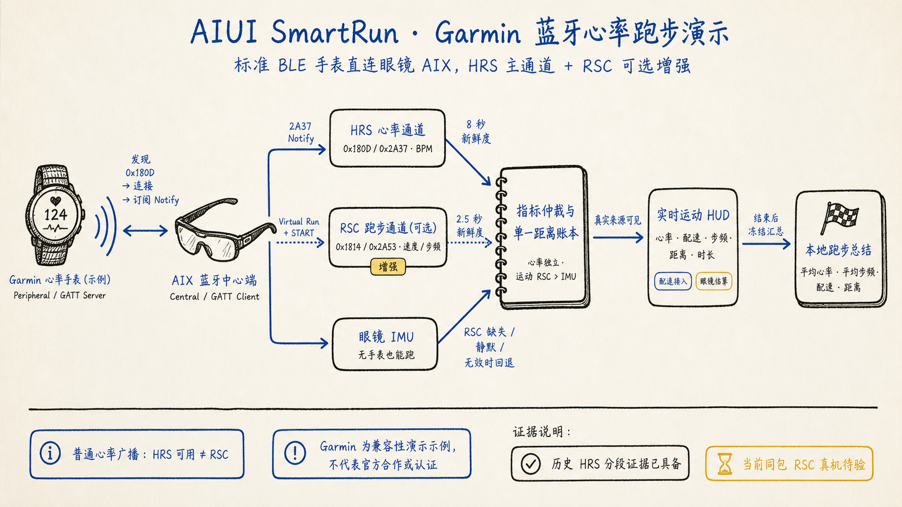

# AISmartRun AIX


> A source-available AIUI running application for smart glasses, centered on
> standard Bluetooth heart-rate and running-speed/cadence sensors.

[](LICENSE)
[](https://github.com/EasonZhu1997/AIUI-Sports-Agents/actions/workflows/validate.yml)

> **License boundary:** this is public source, not OSI open source. Noncommercial
> use is governed by PolyForm Noncommercial 1.0.0. Commercial use requires a
> separate signed agreement; see [commercial licensing](COMMERCIAL_LICENSE.md).

This application is integrated in the public AIUI Sports Agents monorepo at
`apps/smartrun`. The repository root remains Apache-2.0, while this directory
and its descendants are governed by this directory's PolyForm license.



## Bluetooth first

AISmartRun acts as the BLE Central / GATT Client on the glasses:

- HRS `0x180D` + Heart Rate Measurement `0x2A37` is the main path.
- RSC `0x1814` + RSC Measurement `0x2A53` is an optional enhancement for
  compatible devices and modes.
- Ordinary Garmin heart-rate broadcast proves HRS only. It does not prove RSC.
- For the Garmin compatibility demo, select **Virtual Run** and press **START**
  before expecting RSC notifications.
- Missing, invalid, silent, or stale RSC falls back to the glasses IMU without
  tearing down a working heart-rate connection.
- The HUD labels device pace as `配速接入` and fallback motion as `眼镜估算`.

The protocol and freshness contract is documented in
[SMARTRUN_BLE_GATT_CONTRACT.md](docs/SMARTRUN_BLE_GATT_CONTRACT.md).
For a button-by-button compatibility walkthrough, see the
[Garmin / standard BLE demo](docs/GARMIN_BLE_DEMO.md).

## Evidence boundary

Historical segmented evidence includes valid HRS packets from a Garmin Fenix 8
ordinary broadcast and a prior glasses scan/connect path. The current
`0.1.114` build still requires same-build Rokid hardware acceptance for the
first valid `0x2A53` packet, sustained RSC flow, silence/recovery, IMU fallback,
re-anchoring, and the complete HUD-to-summary loop.

Local tests, Reader checks, or an AIX build do not prove those hardware gates.

## Run locally

Requirements: Node.js `24.14.x` and npm `11.9.x`.

```bash
npm ci
npm test
npm run doctor:aiui
npm run build:all
```

Generated `.aix` packages remain local under `release/` and are ignored by Git.
This repository does not upload to AIUI Studio, install to glasses, submit for
review, or publish to a store.

## Coach backend disabled by default

The public source contains no production backend URL or shared key. Its request
wrappers reject non-HTTPS URLs, so the custom coach-backend paths stay inactive
until a developer or user explicitly writes an HTTPS `coach_base_url` to app
storage. AIUI `LanguageModel` is separate from that setting: its prompt uses a
host-managed, OpenAI-compatible network transport when the host reports the
capability as available. Bluetooth running, IMU fallback, HUD timing, and the
deterministic rule-summary fallback do not require either network path.

## EverMind-oriented backend contract

AISmartRun contains an EverMind-oriented client/backend contract for fixed
post-run summaries; it does not vendor an EverMind or Raven SDK. The default
immersive page builds summary context from recent local runs, invokes AIUI
LanguageModel (with a local rule fallback), and queues the resulting fixed
post-run summary for best-effort upload. A
separate compatibility-home path can request remote `memory-context` before
generating that fixed summary. Both coach-backend request paths require an
explicitly configured HTTPS `coach_base_url`.

The public source includes the request builders, queue, ownership guards, and
tests. It does not include an EverMind service, coach-backend implementation,
production endpoint, shared credential, Raven runtime dependency, or evidence
that a particular operator backend routes these records to EverMind. That
external routing is a deployment responsibility. A failed network operation
does not block Bluetooth, IMU, HUD, or local-summary behavior. This contract
currently applies only to AISmartRun. See [PRIVACY.md](PRIVACY.md) before
operating a configured backend.

The current public UI does not provide a separate AIUI-model or network-memory
consent/off control, or a retain/delete choice for already queued records.
Treat this as a developer integration point, not a production privacy-ready
deployment. Add those user-visible controls before enabling a model provider
or preconfiguring a backend for end users.

## Source map

| Path | Purpose |
|---|---|
| `pages/run_hud/` | menu, device search, run HUD, warm-up, recovery, summary |
| `lib/hr.js`, `lib/rsc.js`, `lib/devices.js` | standard BLE parsing and lifecycle |
| `lib/motion_*`, `lib/imu*` | glasses-motion fallback and source arbitration |
| `test/` | parser, lifecycle, UI-state, persistence, and release regressions |
| `tools/` | AIX pack, Reader inspection, doctor, preview, and desktop probes |
| `docs/assets/` | documentation-only architecture images; excluded from AIX runtime |

## Privacy and safety

Do not attach unredacted Bluetooth identifiers, tokens, raw health histories,
or private activity backups to Issues. See [PRIVACY.md](PRIVACY.md) and
[SECURITY.md](SECURITY.md).

Garmin, Rokid, and AIUI are referenced for compatibility only. This project is
not officially affiliated with or certified by those companies.
