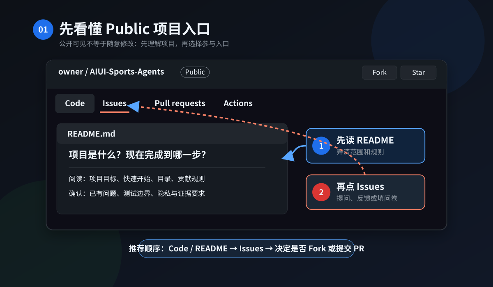
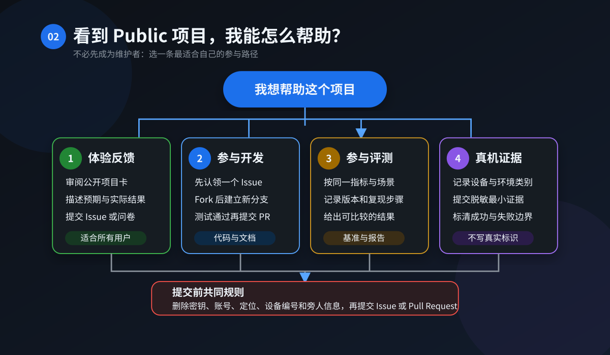
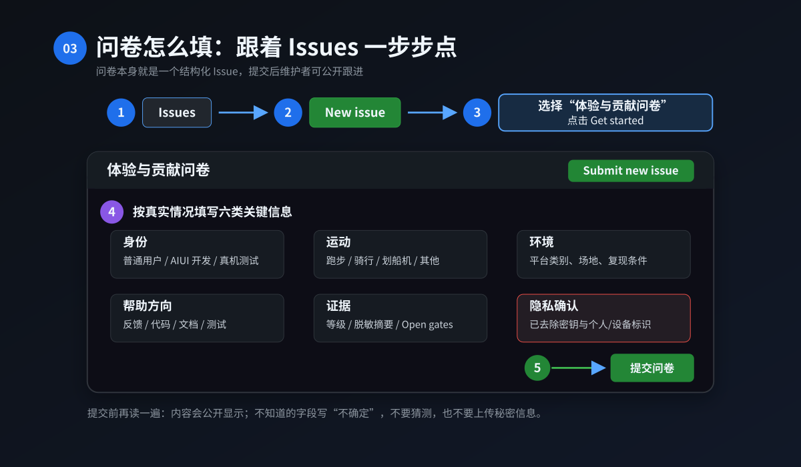
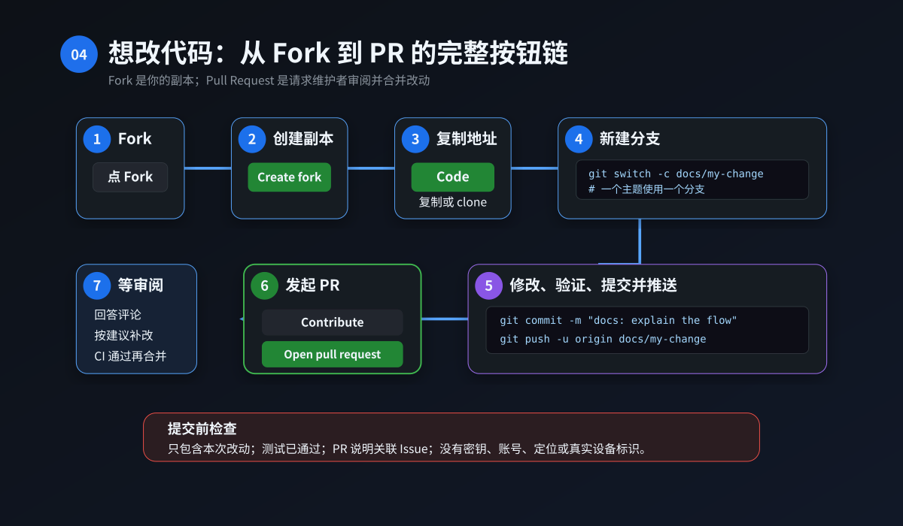
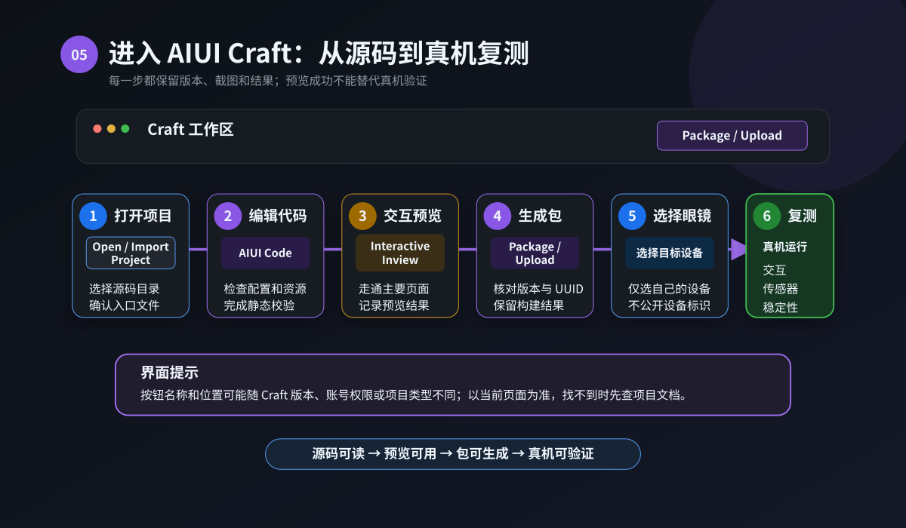
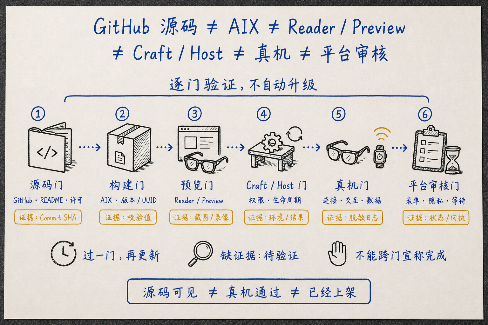
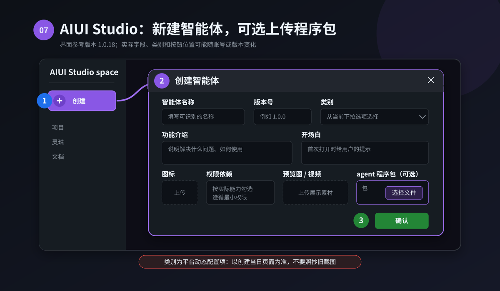
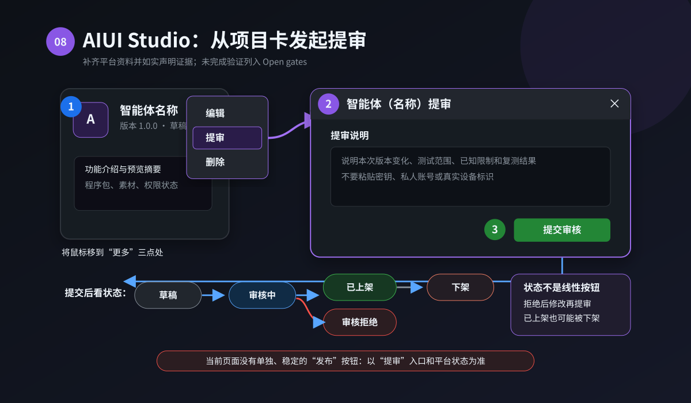

# 手把手图文版：从看到 Public 项目，到参与贡献、填写问卷和提交 AIUI

> 本文以 [AIUI Sports Agents](https://github.com/EasonZhu1997/AIUI-Sports-Agents) 为例，页面与按钮核对日期为 2026-08-31。GitHub、Craft 和 AIUI 页面会更新；如果你的界面文字略有不同，优先找本文标出的同义入口，并以当前页面为准。

> 文中的截图式插图是依据当前按钮路径制作的界面示意图，不是真实账号或审核结果截图；图中没有使用真实 Agent ID、设备标识或个人资料。

第一次接触开源项目时，最容易把几件事混在一起：看到代码、试用项目、提交 Issue、提交 Pull Request、生成 AIX、上传到眼镜、提交平台审核。它们其实是七道不同的门。

这篇文章不要求你先懂 Git。你只要先选一条适合自己的路径，然后跟着按钮走：

| 你现在想做什么 | 从哪里开始 | 最终产物 |
| --- | --- | --- |
| 我只是想帮忙，但不知道做什么 | `Issues` → `New issue` → `体验与贡献问卷` | 一份公开参与问卷 |
| 我遇到了 Bug，或有真机测试结果 | `Issues` → `New issue` → `Bug 与真机证据` | 一份可复现、已脱敏的记录 |
| 我能改代码或文档 | 先开 Issue 对齐 → `Fork` → 分支 → Pull Request | 可评审的代码改动 |
| 我有自己的 AIUI 运动项目 | 先填问卷和项目资料预填表 | Registry/Benchmark 纳入讨论 |
| 我要在眼镜上运行 AIUI | Craft 导入 → 预览 → 上传到眼镜 → 真机复测 | 绑定具体设备环境的验证记录 |
| 我要进入平台审核或商店 | 按平台要求补齐资料，并如实列出未完成的 Open gates | 平台侧提交记录；不等于 GitHub 合并 |



## 一、第一次打开 Public 仓库，先看哪里

### 第 1 步：打开仓库，确认它真的是公开项目

打开：

<https://github.com/EasonZhu1997/AIUI-Sports-Agents>

在仓库名称右侧找到 `Public`。这只表示任何人都可以查看这个仓库，不表示每个文件都允许商用，不表示仓库里的每个项目都已经发布完整应用源码，也不表示 AIX、眼镜真机或 AIUI 商店已经通过。

当前这个仓库的根层是采用 Apache-2.0 的评测、治理和项目索引 Hub；Run、Bike、Rower 的应用源码已通过白名单快照集成在 `apps/`，分别采用 PolyForm 非商业许可与单独商业授权，属于 source-available。根层 Apache 不覆盖三个应用目录，源码可查看也不等于获得商业使用权。

### 第 2 步：先停在 `Code` 页，读完五个位置

不用马上下载。先在 `Code` 页依次看：

1. `README.md`：项目是做什么的、当前能做什么；
2. `CONTRIBUTING.md`：允许贡献什么、哪些内容不能提交；
3. `LICENSE`：你可以怎样使用仓库自有代码和文档；
4. `LICENSE_POLICY.md`：根仓、应用源码、商业授权和第三方内容分别适用哪一层许可；
5. `SECURITY.md`：遇到漏洞时为什么不能直接开公开 Issue。

### 第 3 步：理解顶部几个按钮

| 按钮 | 什么时候点 | 不要误解成什么 |
| --- | --- | --- |
| `Code` | 看文件、README、复制仓库地址 | 点开不等于已经安装或运行 |
| `Issues` | 填参与问卷、报告 Bug、讨论范围 | 不是上传 key、私人日志或漏洞的地方 |
| `Pull requests` | 提交和评审具体改动 | PR 合并不等于 AIX 或平台发布 |
| `Actions` | 看自动检查是否通过 | CI 通过不等于 Rokid 真机通过 |
| `Fork` | 在自己账号下创建可修改副本 | 不会直接修改原仓库 |
| `Star` | 收藏、关注项目 | 不是报名，也不会自动加入贡献者名单 |

## 二、不知道怎么帮？先选一种参与方式



你不需要会写代码才可以贡献。这个项目有四种常见角色：

### 1. 普通体验用户

你可以帮助发现：文字看不清、步骤难理解、状态不诚实、退出不方便、提示太打扰等问题。没有真机也可以先审阅文档、结果卡和交互说明。

### 2. 开发者

你可以修复 Hub 的公共协议契约、评测算法、合成夹具、验证工具、测试和文档。运动应用的算法、页面状态机、产品 UI、连接层和构建工程位于 `apps/`；在正式 CLA 与签署流程启用前，外部参与者应先用 Issue 登记，不要直接提交应用实现 PR。新协议、权限、网络、存储、硬件控制等改动也应先开 Issue 对齐范围，再开始写代码。

### 3. 评测者

你可以复现 Common Benchmark 和某一运动的 Sport Benchmark。Common 可以跨运动比较，Run、Bike、Rower 的专项分只能在同一运动和相近硬件条件下比较。

### 4. 真机或证据贡献者

你可以补 Reader、Craft、Rokid 眼镜、BLE/IMU 外设或现场对照记录。公开的是最小、脱敏、可核对的摘要；真实 MAC、序列号、账号、轨迹、原始长日志和旁人影像留在受控本地环境。

如果还是不知道选哪种，直接填写“体验与贡献问卷”，在“想怎样帮助”中勾选“认领适合新手的任务”。

## 三、手把手填写“体验与贡献问卷”



### 第 1 步：进入问卷选择页

在仓库顶部按顺序点击：

1. `Issues`
2. 右侧绿色按钮 `New issue`
3. 找到 `体验与贡献问卷`
4. 点击右侧 `Get started`

也可以直接打开：

<https://github.com/EasonZhu1997/AIUI-Sports-Agents/issues/new?template=contribution-survey.yml>

GitHub 会要求登录后才能创建 Issue。登录只需要使用你自己的 GitHub 账号；不要在 Issue 中填写密码、验证码或 token。

### 第 2 步：逐项这样填

| 问卷字段 | 怎么选或怎么写 | 一个合格示例 |
| --- | --- | --- |
| 标题 | 保留 `[贡献问卷]` 前缀，后面写项目和目标 | `[贡献问卷] 希望帮助 AIBike 补 Reader 验证` |
| 你以什么角色参与 | 选择最接近的一项 | `真机或外设测试者` |
| 运动类型 | 只选本次主要范围 | `Bike（骑行）` |
| 想帮助哪个项目 | 不确定就选“请维护者协助分流” | `AIBike` |
| 项目或公开资料链接 | 只填公开且有权分享的链接 | `https://github.com/<owner>/<repo>` |
| 你想怎样帮助 | 可以多选 | `Reader / Preview / Craft 验证` |
| 你计划完成什么 | 写目标、产物、需要的帮助 | `复现中文包 Reader，并提交结果摘要` |
| 测试或开发环境 | 写版本和设备类别，不写唯一标识 | `macOS；Reader x.y；Rokid 型号与固件公开版本` |
| AIUI 流程阶段 | 只选择已经完成的阶段 | `已完成本地自动化测试（L1）` |
| 证据等级 | 计划中的验证选 `not_run` | `L1（自动化本地测试）` |
| 证据摘要与开放门 | 同时写通过、失败、跳过、未验证 | `测试通过；Reader 与真机仍未执行` |
| 是否愿意提交 PR | 按实际能力选择 | `愿意，但需要带我完成第一次 PR` |
| 公开与隐私确认 | 阅读后逐项勾选 | 只有确认无敏感信息且有权公开时才勾选 |

### 第 3 步：可以直接参考这个填写示例

```text
标题：[贡献问卷] 希望帮助 AIBike 补充 Reader 验证

角色：普通体验用户
运动：Bike（骑行）
项目：AIBike
帮助方向：完成 Reader / Preview / Craft 验证

目标：按公开说明复现一次 Reader 流程。
预期产物：提交命令、版本、通过/失败和开放门的脱敏摘要。
希望获得的帮助：请维护者确认当前推荐的公开候选版本。

环境：macOS；具体 Reader 版本将在执行后补充；没有填写设备地址。
AIUI 阶段：尚未执行
Evidence level：not_run
Open gates：AIX 身份、Reader、Craft 与 Rokid 真机均未验证。
PR 意愿：暂时只能提供体验反馈或证据。
```

这个示例故意没有写“预计可以通过”。还没执行就写 `not_run`，比提前承诺一个结果更可信。

### 第 4 步：提交前做 30 秒检查

公开 Issue 里不要出现：

- key、token、Cookie、密码、私钥、证书或签名口令；
- 真实 MAC 地址、序列号、账号 ID；
- 精确位置、完整运动轨迹、可追踪个人的时间模式；
- 私有仓库、带凭据的 URL、内网地址、本机绝对路径；
- 未经授权的 SDK、固件、手册、图片、字体、音视频；
- 未脱敏日志、通知内容、聊天记录或旁人影像。

确认无误后，点击页面底部绿色按钮 `Submit new issue`。

### 第 5 步：提交之后会发生什么

维护者会先判断：范围属于 Run、Bike、Rower 还是 Common；材料能否公开；证据等级是否写实；是否适合进入代码 PR。

- 只有想法：先在 Issue 里把范围缩成一个可完成任务；
- 能提供测试：转到“Bug 与真机证据”表单补完整记录；
- 能修改代码：认领 Issue 后走 Fork 和 PR；
- 涉及漏洞或个人数据：停止公开讨论，改走私密安全入口；
- 涉及新的 AIUI 运动项目：先提交公开仓库、许可证、场景和证据边界，再讨论是否纳入 Registry/Benchmark。

## 四、如何提交 Bug 或真机证据

按顺序点击：

1. `Issues`
2. `New issue`
3. `Bug 与真机证据`
4. `Get started`

直接入口：

<https://github.com/EasonZhu1997/AIUI-Sports-Agents/issues/new?template=bug-and-device-evidence.yml>

填写时至少说清：

1. 项目、运动类型和一句话结论；
2. commit、版本、locale 与适用的包身份；
3. Reader/Craft/Host、眼镜型号和固件公开版本；
4. 可复现的最小操作步骤；
5. 预期结果与实际结果；
6. 数据来自 `measured`、`estimated` 还是 `unavailable`；
7. 证据等级 `not_run / L1–L5`；
8. 通过、失败、跳过和 Open gates。

### 一个合格的 Bug 标题

```text
[Bug/证据] AIBike 在断流后功率仍显示为旧值
```

### 一个合格的结果写法

```text
环境：公开版本与设备类别已记录；设备使用别名 bike-a，不公开 MAC。
步骤：连接 → 收到合法数据 → 关闭外设 → 等待超时。
预期：功率变为 unavailable，并显示断流状态。
实际：界面继续显示最后一个 measured 值。
Evidence level：L4，仅适用于所列眼镜、固件、host 和包组合。
Open gates：其他固件与 30 分钟稳定性未验证。
```

安全漏洞、账号、个人数据、危险设备控制或未修复利用方式不要放在这里。请在 Issue 选择页点击 `私密报告安全漏洞`，或直接进入：

<https://github.com/EasonZhu1997/AIUI-Sports-Agents/security/advisories/new>

## 五、会改代码？手把手完成第一次 Pull Request



GitHub 官方推荐的开源贡献主线是：先读规则、找到 Issue、Fork、在主题分支修改、提交并推送，最后创建 Pull Request。

### 第 1 步：先在 Issue 里确认范围

优先选择带 `good first issue` 或 `help wanted` 标签的任务。没有这些标签时，先在对应 Issue 里说明你准备怎么做，等维护者确认方向，避免写完以后才发现范围不合适。

### 第 2 步：点击 `Fork`

在仓库页面右上角点击 `Fork`，进入创建页面后：

1. `Owner` 选择你自己的 GitHub 账号；
2. `Repository name` 通常保持不变；
3. 一般可以保留 `Copy the DEFAULT branch only`；
4. 点击 `Create fork`。

### 第 3 步：复制自己的仓库地址

进入你的 Fork 后，点击文件列表上方绿色按钮 `Code`：

1. 选择 `HTTPS`；
2. 点击地址右侧的复制按钮；
3. 在终端执行下面的占位命令。

```bash
git clone https://github.com/<YOUR_GITHUB_NAME>/AIUI-Sports-Agents.git
cd AIUI-Sports-Agents
git remote add upstream https://github.com/EasonZhu1997/AIUI-Sports-Agents.git
git remote -v
```

不要把 token 拼进 URL。GitHub 登录使用系统凭据管理或 GitHub CLI；不要把 token 粘到 Issue、PR、截图或聊天中。

### 第 4 步：为一个问题创建一个分支

```bash
git switch -c docs/improve-bike-reader-guide
```

分支名用 `docs/`、`fix/`、`test/` 等前缀说明改动类型。一个分支只解决一个清晰问题。

### 第 5 步：修改后先看清自己改了什么

```bash
npm test
npm run report
git status --short
git diff --check
git diff
```

只运行仓库真实提供的命令。如果某项没有运行，就在 PR 中写 `not_run` 和原因。

### 第 6 步：只暂存本次相关文件

```bash
git add -- path/to/changed-file
git diff --cached
git commit -m "docs: clarify bike Reader evidence"
git push -u origin docs/improve-bike-reader-guide
```

首次贡献不建议直接使用 `git add .`。明确列文件能减少把 `.env`、日志、包、缓存或私人材料意外提交的风险。

### 第 7 步：在 GitHub 创建 Pull Request

推送后回到你的 Fork：

1. 点击页面提示中的 `Compare & pull request`；
2. 如果没有提示，点击 `Pull requests` → `New pull request`；
3. 某些页面也会显示 `Contribute` → `Open pull request`，可以从这里进入同一比较页；
4. 确认 `base repository` 是 `EasonZhu1997/AIUI-Sports-Agents`；
5. 确认 `base` 是 `main`；
6. 确认 `head repository` 是你的 Fork；
7. 确认 `compare` 是刚才的主题分支；
8. 填写标题和 PR 模板；
9. 准备好后点击 `Create pull request`。

PR 模板会要求你填写：Scope、实际测试、Evidence、Data Source、Privacy、Third-party、Safety、Open gates 和 Release boundary。不要删除没有完成的检查项；把未完成项写清楚更容易获得有效评审。

### 第 8 步：维护者要求修改时，不要另开一个 PR

继续在同一分支修改、测试、commit 并 `git push`，原 PR 会自动更新。回答评审意见时说明“改了什么、运行了什么、还有什么没验证”。

## 六、从开源项目到 AIUI：Craft 中应该按什么顺序



先看最重要的边界：本总仓的 `apps/` 已提供三个运动应用的可构建源码。进入对应目录可在本地生成 Run、Bike 或 Rower AIX；但本地包不等于 Craft、眼镜或平台已经验证，仓库命令也不会自动上传、安装、提审或上架。

Rokid 当前公开指南给出的主线是：创建或取得 AIUI 项目 → 在 Craft 中打开 → 使用 AIUI Code 开发 → 用 Interactive Inview 预览 → 选择上传/部署到眼镜 → 真机复测。不同账号、地区和 Craft 版本的按钮文案可能不同。

### 第 1 步：准备环境

准备：

- Node.js 与 npm；
- 可以登录 Craft 的 Rokid 账号；
- 目标 AIUI 项目源码；
- 需要做 L4 时准备已连接的 Rokid Glasses；
- 不进入源码的运行时配置与凭据。

如果从官方模板开始，可参考官方当前命令：

```bash
npm create @yodaos-pkg/aiui-agent my-agent
```

如果从开源仓库开始，先确认它确实包含 `AGENTS.md`、`app.json`、`app.js`、`pages/` 等可运行项目文件，而不只是项目卡或评测文档。

### 第 2 步：在 Craft 点击打开或导入项目

进入 Craft 并登录后，寻找 `Open Project`、`Import Project`、`打开项目` 或 `导入项目` 一类入口，选择项目根目录。导入完成后检查：

- 文件树中能看到项目核心文件；
- `app.json` 的页面路由与实际文件一致；
- `AGENTS.md` 的名称、版本、能力与项目用途一致；
- 没有把 `.env`、证书、私有 SDK 或无关大文件放进项目。

### 第 3 步：使用 AIUI Code 开发，但人工检查结果

打开 `AIUI Code`，用明确需求生成或修改页面。每次有实质变化后都检查代码和预览，特别是页面入口、权限、网络、存储和错误状态。AI 生成代码不是测试结果，也不会自动获得 L1。

### 第 4 步：先做 Preview / Interactive Inview

在预览区打开 `Interactive Inview`，使用屏幕控制模拟 Rokid 眼镜按键，完整走一遍：启动、主要流程、返回、退出、错误、数据缺失和恢复。

这一步最多支持 Reader/Preview/Craft 层面的结论。模拟按键成功，不代表 BLE、IMU、双设备、后台恢复和真机功耗已经通过。

### 第 5 步：准备并记录 AIX 候选

当 Craft 或项目工具提供打包能力时，记录：

```text
AIX 文件名：
语义版本：
Locale：
UUID：
大小：
SHA-256：
对应 source commit：
```

对实际包重新做密钥、第三方、隐私、许可作用域和内容检查。根层 Hub 采用 Apache-2.0、`apps/` 应用源码采用 PolyForm Noncommercial，都不代表包内字体、SDK、图片、固件或其他第三方内容自动采用同一许可证；AIX 的商业分发还必须符合实际应用源码许可和单独合同。

### 第 6 步：选择上传或部署到眼镜

根据当前 Craft 页面寻找 `Upload`、`Deploy`、`上传` 或 `部署` 一类入口，然后：

1. 核对 Agent 名称、分类和描述；
2. 核对请求的能力和权限，只保留确实需要的项目；
3. 选择当前可用或已连接的 Rokid Glasses；
4. 确认上传的是刚刚审计并记录 hash 的候选；
5. 按页面提示完成上传。

上传文件和点击最终确认会改变外部设备或账号状态，应由项目发布负责人使用自己的账号执行。不要通过聊天传递账号、验证码、token 或签名材料。

### 第 7 步：在眼镜上重新完成一次完整流程

上传完成后，在眼镜上打开 Agent，至少复测：

- 启动、主要场景和明确退出；
- 文字可读性、按键与误触；
- BLE/IMU 首个合法数据、断流和重连；
- 隐藏/恢复、资源清理和重复进入；
- 失败、不可用与降级状态；
- 适用时的 15–30 分钟稳定性。

只有绑定具体包、眼镜型号、固件、AIUI host build 和外设类别的记录，才能写成 L4。上传到自己的眼镜，不等于已经提交 Agent Store 或平台审核。

## 七、AIUI Studio：创建智能体并提交审核

先把“问卷”说清楚：

- 前文的“体验与贡献问卷”是 **AIUI Sports Agents 自己的 GitHub Issue Form**，用于收集开源贡献、测试和证据；
- 当前 AIUI Studio 页面没有一个固定名称为“问卷”的通用入口；
- AIUI Studio 的真实流程是填写“创建智能体”表单，然后从项目卡执行“提审”；
- 如果你拿到的是某次活动、飞书或第三方问卷，必须按那个具体链接和当时字段填写，不能把它当成通用 Studio 提交流程。



### 第 1 步：打开 AIUI Studio 项目空间

进入：

<https://aiui.rokid.com/space>

截至本文核对日期，当前生产页面加载的 AIUI Studio 前端版本为 `1.0.18`。页面左侧可以看到：

- `AIUI Studio`
- `创建`
- `项目`
- `灵珠`
- `文档`

主区域也提供 `创建` 按钮。

### 第 2 步：处理登录或专业认证提示

未登录时，页面会跳转到 Rokid 账号登录。使用自己的 Rokid 账号完成登录，不要向其他人提供密码、验证码或 Cookie。

如果页面返回 403，并提示账号尚未完成专业认证：

1. 点击页面提供的 `立即前往`；
2. 在账号中心按当前页面填写认证资料；
3. 认证审核中就等待页面状态更新，再回到 AIUI Studio。

公开页面没有稳定展示专业认证表的全部字段，因此本文不编造姓名、企业、证件等字段。以账号中心当时页面为准。

### 第 3 步：点击“创建”

点击左侧或主区域的 `创建`。页面会打开标题为 `创建智能体` 的弹窗，底部有：

- `确认`
- `取消`



### 第 4 步：填写基础信息

先打开仓库中的 [AIUI 项目提交资料预填表](../docs/AIUI_SUBMISSION_WORKSHEET.md)，把项目事实整理好，再逐项填写：

| Studio 字段 | 当前限制 | 推荐写法 |
| --- | --- | --- |
| 智能体名称 | 必填，最多 20 个字符 | 与 `AGENTS.md`、AIX 和公开资料使用同一名称 |
| 版本号 | 必填；`A.B` 或 `A.B.C`；每段 0–9999 | 使用明确语义版本；更新版本必须高于上一版 |
| 类别 | 必填；选项由后台动态配置 | 在当前可见类别中选最贴近真实场景的一项 |
| 功能介绍 | 必填，最多 500 个字符 | 写清谁在什么场景解决什么问题 |
| 开场白 | 必填，最多 500 个字符 | 告诉用户能做什么、怎样开始和退出 |
| 图标 | 必填；jpeg/jpg/png/gif | 使用有权公开、没有账号或个人信息的素材 |

类别不能写死为永久的“生活/工作/娱乐/学习”，因为当前页面会用后台配置替换选项。运动项目在当时可见项里选择最贴切的一类即可。

### 第 5 步：只勾真正需要的权限依赖

当前创建表单提供的权限依赖包括：

- 网络
- 摄像头
- 语音识别
- 麦克风

不要为了“以后也许会用”全部勾选。每一项权限都应能回答：

1. 哪个功能需要它；
2. 数据在哪里处理；
3. 是否保存、保存多久；
4. 是否上传、上传给谁；
5. 用户怎样关闭和删除。

纯本地 BLE/IMU 运动闭环不应因为页面有网络选项就默认联网。

### 第 6 步：上传预览素材

当前页面接受：

- JPG / JPEG / PNG 图片；
- MP4 视频；
- 最少 3 个、最多 5 个预览素材；
- 单张图片不超过 5 MB；
- 单个视频不超过 50 MB。

提交前检查素材没有账号名、通知、位置、运动轨迹、设备序列号、真实 MAC、旁人画面或未经授权的字体、音乐和图片。

### 第 7 步：选择是否上传 AIX

在 `agent程序包` 一栏点击 `选择文件`。当前前端只接受：

- 扩展名 `.aix`
- 文件大小 1 KB–10 MB

注意：10 MB 只是当前平台前端上限。若目标子项目、活动或候选另有更严格门（例如 2 MB），继续按那个明确规则执行，并在结果卡中写清；不能用平台上限覆盖子项目规则。

选中 AIX 后，页面会自动读取并以只读方式展示：

- 文件 md5 值；
- JSUI 包标题；
- JSUI 包版本；
- JSUI 包页面；
- JSUI 包工具。

平台显示 MD5 时，发布记录仍建议另外保存 SHA-256、AIX UUID、locale 和 source commit。上传的是哪一个精确候选，必须能反向追溯。

当前“创建智能体”弹窗并没有在前端强制要求立刻上传 AIX：

- 不选 AIX 后点击 `确认`：创建成功后会自动打开 Craft；
- 已选择 AIX 后点击 `确认`：项目会留在项目空间；
- 后续可以从项目卡 `编辑` 中补充或替换 AIX。

### 第 8 步：做提示词命中测试

页面右侧有提示词命中测试输入框：

1. 输入一个真实用户可能说出的意图；
2. 点击 `立即测试`；
3. 查看 `测试通过` 或 `未命中`；
4. 如果未命中，回到项目描述、工具和提示词配置检查原因。

一次命中只说明这个输入命中了当前配置，不等于所有表达方式、真机语音或完整业务流程都通过。

### 第 9 步：点击“确认”创建项目

再次核对名称、版本、类别、介绍、开场白、权限、素材和 AIX 身份，然后点击 `确认`。

创建成功不等于已经提审，也不等于已经上架。此时项目通常仍是 `草稿`。

### 第 10 步：从项目卡进入“提审”

回到项目空间，找到刚创建的项目卡。卡片底部会显示 Agent ID 和复制按钮；公开截图、Issue 或文章中不要随意暴露可追踪的真实 Agent ID。

把鼠标移到项目卡的三点 `更多` 菜单，当前可见操作是：

- `编辑`
- `提审`
- `删除`

点击 `提审`。



### 第 11 步：填写提审说明

页面会弹出 `智能体(<名称>)提审` 对话框：

1. 在输入框填写提审相关说明；
2. 内容不能为空，最多 2000 个字符；
3. 说明本次版本改了什么、证据到哪一级、还剩什么 Open gates；
4. 核对后点击 `提交审核`；
5. 不准备提交就点击 `取消`。

可以参考这个提审说明：

```text
版本：0.0.1
项目：AISmartRower
用途：读取兼容划船机的标准 FTMS Rower Data，在眼镜端显示训练遥测。
安全边界：当前只读，不发现、订阅或写入 Fitness Machine Control Point 0x2AD9。
公开证据：L2，已完成所列自动化测试和包/Reader 检查。
隐私：默认离线，不上传设备名、设备标识、轨迹或原始逐包日志。
Open gates：Craft 当前版本、Rokid 真机双设备和 15–30 分钟稳定性仍待验证。
```

点击 `提交审核` 是进入平台审核链的外部提交动作。应由项目负责人核对当前账号、候选 AIX、公开素材、权限和授权后执行。

### 第 12 步：看状态，不要杜撰“已发布”

提交成功后页面会提示 `提交成功。`。当前 Studio 使用的状态包括：

- `草稿`
- `审核中`
- `审核拒绝`
- `下架`
- `已上架`

当前生产前端没有一个单独、稳定的“发布”按钮。提审后由审核/商店流程更新状态，因此不要写“审核通过后再点发布”，也不要在状态仍是“审核中”时宣传“已上架”。

### Craft、眼镜上传与 Studio 提审仍然是三件事

- Craft / Interactive Inview：开发和预览；
- Upload / Deployment 到眼镜：把候选放到所选设备上做真机复测；
- AIUI Studio `提审 → 提交审核`：进入平台审核/上架链路。

GitHub Fork/PR、社区贡献问卷、Craft 眼镜上传、Studio 提审四条链互不自动触发。只完成其中一条，就只声明那一条的状态。

## 八、维护者收到问卷以后，怎样把帮助变成可合并结果

对项目维护者，推荐按这个顺序处理：

1. **公开性检查**：先看 Issue 是否含凭据、个人数据、设备标识或未授权材料；
2. **范围分流**：标记 Run、Bike、Rower、Common 或新项目；
3. **证据校准**：确认 not_run/L1–L5 与实际材料一致；
4. **拆任务**：把大想法拆成一个可以测试、可以评审的 Issue；
5. **认领确认**：贡献者说明计划，维护者确认方向；
6. **PR 检查**：实现、测试、数据来源、隐私、第三方和 Open gates 一起评审；
7. **CI 与人工评审**：自动检查通过后仍需判断产品和证据边界；
8. **合并但不越级发布**：合并只改变源码；AIX、眼镜、平台审核另走发布门。

第一次贡献只要把范围写清、材料可公开、结果诚实，即使只补一个错别字、一个失败样例或一次 `not_run` 到 L1 的升级，也有价值。

## 九、所有参与者都要遵守的规则

### 规则 1：数据来源必须诚实

关键指标标成 `measured`、`estimated` 或 `unavailable`。拿不到的数据保持 unavailable，不能用 0 或无关字段冒充实测。

### 规则 2：证据不能越级

- L1：自动化本地测试；
- L2：AIX 与 Reader/Preview；
- L3：Craft/Host 集成环境；
- L4：绑定具体组合的 Rokid 真机；
- L5：完整现场对照。

Preview 通过不能写成真机通过；扫描到设备不能写成收到合法数据；一次成功不能写成长时间稳定。

### 规则 3：不同运动不硬凑一个总分

Common 指标可以比较共同底线。Run、Bike、Rower 的 Sport 指标只在同一运动、同类协议和相近硬件条件下比较。

### 规则 4：隐私和安全问题优先走私密通道

公开 Issue 和 PR 不接收 key、token、个人轨迹、真实 MAC、序列号、私有链接或未脱敏日志。安全漏洞使用 Private vulnerability reporting。

### 规则 5：Rower 当前只读

AISmartRower 当前只允许读取 FTMS Rower Data 和可选 HRS，不发现、订阅或写入 Fitness Machine Control Point `0x2AD9`。器械控制必须另立协议契约、威胁模型、用户确认和治理审批。

### 规则 6：合并不等于发布

PR 合并、tag、GitHub Release、AIX、眼镜上传、AIUI 审核和商店上架是不同动作。每个外部发布动作都要核对具体对象、账号、版本、hash 和授权。

## 十、一张可以照着勾的清单

### 普通参与者

- [ ] 我确认仓库是 Public，但没有把项目卡当成完整应用源码。
- [ ] 我读过 README、CONTRIBUTING、LICENSE 和 SECURITY。
- [ ] 我通过 `Issues → New issue → 体验与贡献问卷` 选择了参与方向。
- [ ] 我没有填写 key、账号、设备唯一标识、位置轨迹或私有链接。
- [ ] 我只选择已经完成的 Evidence level。
- [ ] 我把失败、跳过和 Open gates 一起写了出来。

### 代码贡献者

- [ ] 我先在 Issue 中确认范围，再 Fork 和创建主题分支。
- [ ] 我只暂存本次相关文件，并检查了 staged diff。
- [ ] 我运行了仓库实际提供的测试，未运行项写成 not_run。
- [ ] PR 模板中的 Data Source、Privacy、Third-party 和 Open gates 已填写。
- [ ] 我理解 PR 合并不会自动上传 AIX 或 AIUI 平台。

### AIUI 提交者

- [ ] 我使用的是完整、有权使用的 AIUI 应用源码，不是项目索引总仓。
- [ ] 我核对了 `AGENTS.md`、`app.json`、页面入口和最小权限。
- [ ] 我分别记录了 Preview、Craft、眼镜和现场证据。
- [ ] AIX 文件名、版本、locale、UUID、SHA-256 和 source commit 一致。
- [ ] 我已填写 [AIUI 项目提交资料预填表](../docs/AIUI_SUBMISSION_WORKSHEET.md)。
- [ ] 我知道当前按钮是“上传到眼镜”还是“提交平台审核”，没有混写状态。
- [ ] 最终提交由项目负责人核对账号、候选和授权后执行。

## 十一、如果你是项目作者：从本地白名单快照上传到 GitHub

这一节只给准备创建公开仓库的项目作者使用。普通贡献者仍按前面的 Issue、Fork 和 Pull Request 流程参与，不需要自己重新建仓库。

### 第 1 步：冻结准备公开的候选

先记录项目 ID、source commit、版本和发布负责人。不要把现有私有工作目录连同 `.git` 历史整体推上去，也不要从“哪些文件要排除”反推公开范围；应从一份明确允许公开的文件白名单开始。

在 AIUI Sports Agents 总仓中，先建立仅供本机使用的项目路径配置：

```bash
test -e registry/local-projects.json || \
  cp registry/local-projects.example.json registry/local-projects.json
```

如果配置已经存在，上面的命令会保留原文件，直接编辑即可，不要覆盖。打开 `registry/local-projects.json` 后，只在本机填写源码目录。这个文件已经被 `.gitignore` 排除；不要把本机路径复制到 Issue、PR 或文章中。

### 第 2 步：先预演白名单导出

先执行严格本地审计，再以 `aibike` 为例预演：

```bash
npm run audit:local:strict
npm run export:dry -- --project aibike
```

严格审计在存在 blocker 时返回非零；warning 用于提醒你核对仍留在原仓、但被白名单排除的本地材料。预演即使失败也会打印候选数量和 manifest，方便完成审批记录，但失败状态不能被当作通过。

可用项目 ID 为 `smartrun`、`aibike`、`aismartrower`。预演只列出计划文件、总大小和 blocker，不写 `dist/`，也不创建远端仓库。

当前导出器从允许的根文件和 `assets/`、`docs/`、`lib/`、`pages/`、`scripts/`、`test/`、`tools/` 中取文件，并排除 `.git`、`node_modules`、缓存、日志、现场证据、AIX/APK、证书、私钥、数据库和 ZIP 等内容。单个源码文件超过 2,000,000 bytes 时会要求人工复核；这是源码白名单的单文件阈值，不是 AIX 包体上限。

预演会输出候选的 `content manifest SHA-256`。应用仓必须按 [`SOURCE_DISTRIBUTION_APPROVAL.json`](../docs/SOURCE_DISTRIBUTION_APPROVAL.md) 记录真实许可方、贡献者/第三方权利审查、Git 修订、审阅者、日期与该 manifest；出现 blocker 或命令退出非零时就停下处理，不要绕过检查。

### 第 3 步：生成干净快照，并在快照中复测

只有预演通过后才执行：

```bash
npm run export:local -- --project aibike
```

工具会生成 `dist/aibike/`，但不会上传、签名、安装或发布任何内容；如果目标目录已存在，它会拒绝覆盖。进入干净快照后：

1. 用 `rg --files` 逐项确认公开文件；
2. 检查 LICENSE、README、SECURITY、PRIVACY、第三方说明和构建说明是否齐全；
3. 再扫描 key、token、证书、内部 URL、本机绝对路径、账号、设备标识和个人数据；
4. 只运行这个快照真实提供的安装、测试和构建命令；
5. 记录通过、失败、跳过和 Open gates。

原工作区通过不能代替干净快照复测。

### 第 4 步：在 GitHub 页面点击创建 Public 仓库

登录自己的 GitHub 账号后：

1. 点击页面右上角 `+`；
2. 点击 `New repository`，也可以直接打开 <https://github.com/new>；
3. `Owner` 选择负责维护项目的账号或组织；
4. 填写 `Repository name` 和简短 `Description`；
5. `Visibility` 选择 `Public`；
6. 如果干净快照已经有 README、`.gitignore` 和 LICENSE，不要在这里重复初始化这些文件；
7. 点击 `Create repository`。

这里创建的应该是一个空远端仓库，便于把刚才审计过的快照作为唯一首次提交推上去。

### 第 5 步：在干净快照中建立首次提交

下面命令只能在刚才生成并复核过的公开快照根目录执行。把大写占位文字换成自己的值后再运行：

```bash
cd "YOUR_PUBLIC_SNAPSHOT_DIR"
git init -b main
git config user.name "YOUR_PUBLIC_NAME"
git config user.email "YOUR_GITHUB_NOREPLY_EMAIL"
git status --short
git add -A
git diff --cached --check
git diff --cached --name-status
git commit -m "chore: publish initial source-available snapshot"
git remote add origin https://github.com/YOUR_ACCOUNT/YOUR_REPOSITORY.git
git remote -v
git push -u origin main
```

这里允许 `git add -A` 的前提是：你已经进入新生成的干净快照、核对过当前目录和全部文件。不要在原始私有工作目录照抄这条命令。GitHub noreply 邮箱可在自己的 GitHub 邮箱设置页查看；不要使用别人的邮箱，也不要把 token 写进 remote URL。

### 第 6 步：回到网页验收公开结果

首次 push 完成后逐项点击检查：

1. 仓库名称右侧显示 `Public`；
2. `Code` 页只有白名单文件，README 和 LICENSE 能正常显示；
3. 若仓库配置了工作流，`Actions` 中的自动检查已经通过；没有工作流就如实标成开放门；
4. `Settings` → `General` 中已启用 `Issues`；
5. `Settings` → `Security` → `Code security and analysis` 中已启用 `Private vulnerability reporting`；
6. `Issues` → `New issue` 能看到准备好的问卷或 Bug 模板；
7. 新建测试 Pull Request 时，PR 模板会自动出现。

如果这是你自己的独立运动应用仓库，问卷、PR 模板和评测文件也要按该应用的真实范围调整，不能直接复制一个看似完整、实际不适用的模板。

完成这一步只代表 GitHub 源码仓库已公开。AIX 生成、Craft 预览、眼镜上传、AIUI Studio 提审和商店上架仍按前文分别执行并记录。

## 官方参考

- [GitHub：Contributing to open source](https://docs.github.com/en/get-started/exploring-projects-on-github/contributing-to-open-source)
- [GitHub：Creating an issue](https://docs.github.com/en/issues/tracking-your-work-with-issues/using-issues/creating-an-issue)
- [GitHub：Fork a repository](https://docs.github.com/en/pull-requests/collaborating-with-pull-requests/working-with-forks/fork-a-repo)
- [AIUI Studio 项目空间](https://aiui.rokid.com/space)
- [Rokid 开放平台](https://open.rokid.com/?lang=cn)
- [Rokid AIUI 文档](https://js.rokid.com/AIUI/guide/quickstart-first-immersive)
- [Rokid：创建 AIUI Agent 并上传到眼镜](https://global.rokid.com/blogs/academy-glasses/glasses-3-6-aiui)

开源不是把文件丢到网上，而是让陌生人看得懂、敢参与、能复现，也知道什么时候应该停下来保护隐私和安全。只要把“看项目、填问卷、做贡献、生成包、上眼镜、交平台”六件事分清楚，第一次参与 AIUI 开源项目就不会迷路。
